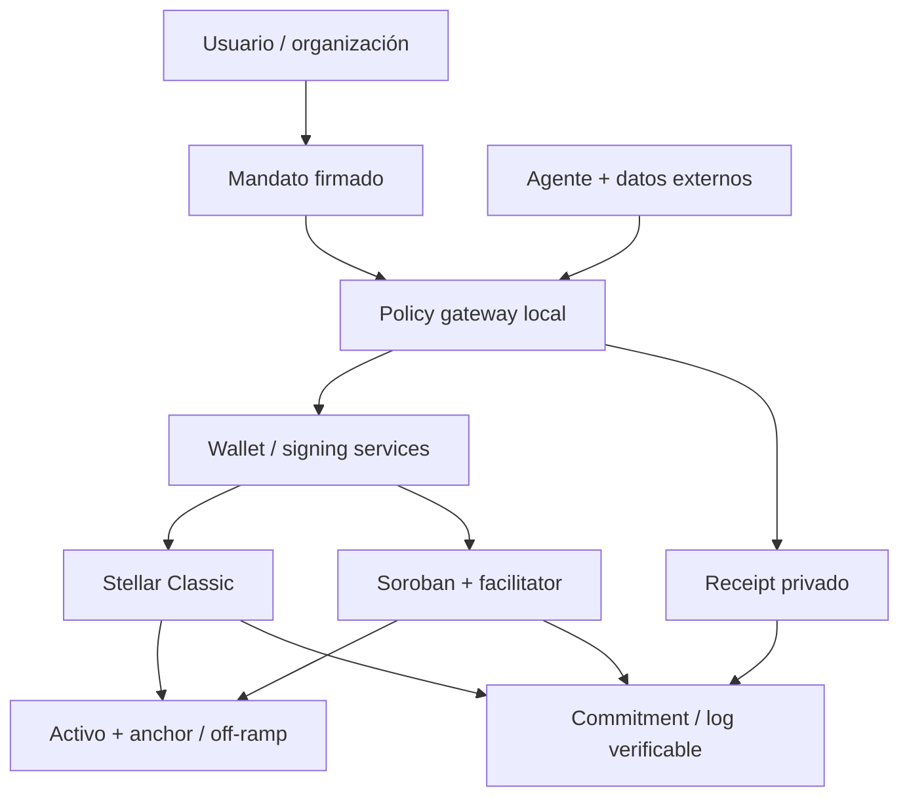

# ALAIA proof: pagos de agentes, verificación y AI local sobre Stellar

**Informe de investigación y revisión de arquitectura · 1 de octubre de 2026**  
Idioma: español; nombres de protocolos y technical terms conservados en English.  
Alcance: arquitectura y posicionamiento para un hackathon; hipótesis del proyecto sometidas a contraste.

## Cómo leer la evidencia

Las referencias [S01]–[S118] remiten a la bibliografía anotada, que indica URL, fecha de publicación conocida, tipo de fuente y fiabilidad. **High** significa que la fuente sostiene directamente el mecanismo o hecho descrito; **Medium**, evidencia parcial, experimental o comercial; **Low**, afirmación no corroborada. Salvo indicación contraria, cada afirmación hereda fecha, tipo y confianza de su referencia; en recomendaciones se indica análisis propio. La confianza concreta aparece en los pasajes controvertidos y en las tablas. Una especificación demuestra lo que debe implementar un sistema, no que todas sus instalaciones lo cumplan. Un audit cubre una versión y un alcance, no toda integración posterior.

**verify** identifica hechos posteriores al 30 de junio de 2026 y documentación viva cuyo estado de despliegue, API, licencia o compatibilidad debe volver a comprobarse antes de implementar. Las páginas sin fecha se registran como **s.f.; consulta 01-10-2026**, sin confundir la fecha de rastreo con la de publicación. No se inspeccionaron wallets privadas ni se ejecutaron benchmarks, transacciones mainnet o pruebas legales de clasificación. Las recomendaciones, cálculos de ejemplo y criterios de aceptación se distinguen como análisis propio.

Se siguieron cuatro fases: mapa de protocolos y productos; lectura de specs, docs, repositories, audits y papers; búsqueda de contraejemplos y contradicciones; síntesis por trust boundary. Los anuncios sirven para confirmar existencia y alcance declarado; no se utilizan como medición independiente de adopción.

## 1. Resumen ejecutivo

**El proyecto tiene una oportunidad como policy gateway local con evidencia verificable, pero su diseño actual no demuestra una “prueba de decisión de AI”.** Las firmas certifican que ciertas claves autorizaron una transacción. Un Merkle commitment permite detectar alteraciones de los datos revelados. Ninguna de esas propiedades demuestra que los LLM se ejecutaron, que respetaron el prompt o que su evaluación fue correcta. El propio ERC-8004 distingue registro de identidad de validación de capacidades; la multisig de Stellar opera sobre claves y thresholds. [S35, S58, S62; High]

El mayor problema es la frontera de firma. Si un único proceso puede acceder a las dos claves, devolver dos checklists ficticios y firmar, la diversidad de modelos no añade aislamiento frente a malware. Si la wallet original mantiene una vía de firma suficiente, el usuario o el agente puede saltarse el gateway. Por tanto, “cada pago pasa por ALAIA proof” exige una configuración verificable del control de fondos y cobertura de todos los caminos que mueven valor, no solamente una pantalla previa al botón de enviar. Esta es una inferencia de arquitectura a partir de la autorización nativa y de las advertencias del Stellar Agent CLI sobre acceso del agente a claves locales. [S34–S37; High]

La segunda incompatibilidad afecta la interoperabilidad. **El scheme x402 exact de Stellar leído usa Soroban y tokens SEP-41; excluye el camino Classic Payment.** El cliente firma auth entries y el facilitator reconstruye el envelope para pagar fees y aportar su sequence number. Las autorizaciones de invocación no equivalen a firmas sobre todo el envelope y su memo. El MVP debe escoger entre un pago Classic controlado de extremo a extremo, o una integración Soroban con evidencia vinculada a la autorización y al settlement. No debe presentar el primero como implementación del segundo. [S03, S38; High, verify]

La tercera debilidad es la promesa de replay. llama.cpp documenta que batch size y KV cache pueden producir logits no idénticos; fijar seed y temperature no fija toda la aritmética. Qwen3 también desaconseja greedy decoding en thinking mode. La afirmación defendible es “receipt íntegro y reproducción bajo un runtime fijado”, condicionada a mediciones. “Cualquiera puede reproducir exactamente en cualquier equipo” debe retirarse. [S64, S78; High]

El mercado de wallets de agentes ya ofrece spending caps, allowlists, permisos revocables, aprobación humana y audit trails. Soneso publica específicamente una Stellar Agent Wallet en alpha con policy engine, aprobación de operador y hash-chained audit log. OpenZeppelin separa signers, context rules y policies en smart accounts. Fireblocks, Coinbase, Privy y Crossmint cubren buena parte de la autorización y custodia. El espacio diferencial es la **evaluación local de correspondencia entre intención autorizada, contexto de compra y efecto económico**, con un corpus adversarial reproducible y receipts exportables. Aún es una hipótesis comercial y de seguridad. [S23–S32, S41–S43; Medium, verify]

La adopción de pagos agentic no puede inferirse de transacciones on-chain. Un preprint independiente de julio analiza 136.708.672 settlements x402 en Base durante 280 días, por USD 44.121.383,81. Clasifica 21,20% del conteo como ficticio y 63,78% como settlement interno de clusters vinculados. Sus límites para valor independiente son amplios; no representan una medición completa de comercio real ni prueban que el pagador fuera un LLM autónomo. Es evidencia contra usar conteo bruto como tamaño de mercado, no contra toda utilidad de x402. [S19; Medium, verify]

**Recomendación para el hackathon:** demostrar un pago legítimo, una factura manipulada que conserva un importe permitido, una sustitución de destinatario, un intento de bypass de firma y una disputa reconstruible. La política determinista debe imponer el límite de pérdida; los LLM deben detectar ambigüedad y escalar. Un resultado de ambos “ALLOW” nunca debe ampliar permisos. La demo necesita pruebas negativas de la configuración Stellar y medición de false positives, no únicamente una transferencia exitosa. Recomendación propia basada en [S04, S20–S22, S67–S73].

| Decisión crítica | Recomendación | Confianza |
|---|---|---|
| Reglas deterministas | Mantener y convertirlas en autoridad sobre permisos y budgets | High |
| Dos LLM locales | Mantener como experimento con ablation; usar familias distintas | Medium |
| Unanimidad | Usar como condición de autoejecución; desacuerdo pasa a revisión | Medium |
| 2-of-2 irreversible, master weight 0 | Cambiar: recuperación y separación de signing services | High |
| MEMO_HASH | Mantener para Classic donde sea compatible; no llamarlo proof of inference | High |
| Replay universal | Retirar la garantía; medir replay por runtime y equivalencia de decisión | High |
| Classic frente a Soroban | Classic para MVP limitado; Soroban para políticas on-chain y x402 exact | High, verify |

El riesgo de posicionamiento también es jurídico: “proof” puede sugerir una garantía que el sistema no entrega. Las condiciones de Circle asignan al operador responsabilidad por agentes y credenciales e indican límites de controles automáticos; el empleo de AI no crea una entidad que asuma por sí misma las obligaciones del cliente. US stablecoin legislation, MiCA y Travel Rule actúan sobre emisores, servicios y participantes humanos o jurídicos, no sobre una supuesta persona autónoma on-chain. [S18, S94–S99; High para textos; aplicación al proyecto: Medium]

## 2. Stack map

El diagrama muestra capas de responsabilidad, no equivalencia entre productos ni compatibilidad automática. A2A y MCP comunican; AP2 y Verifiable Intent transportan evidencia de autorización; x402 y MPP coordinan cobro; wallets firman; chains liquidan activos; anchors y bancos convierten a fiat. [S01–S18, S49–S50]

| Capa, de arriba hacia abajo | Función | Protocolos y productos que se ubican aquí | Trust boundary que debe revisar ALAIA |
|---|---|---|---|
| Usuario / organización | Autorizar una finalidad, contraparte y presupuesto | Passkeys, aprobación humana, AP2 open mandates, Visa payment instructions | Intención humana → mandato interpretable por código |
| Agente / herramientas | Buscar, negociar y proponer una compra | A2A, MCP, AgentCore; documentos, APIs y merchant metadata | Datos externos → propuesta; tratar el agente como potencial atacante |
| Policy y verificación | Comprobar permisos, contexto y riesgo | ALAIA proof; Fireblocks/Privy policies; Crossmint permissions; Soneso; OpenZeppelin policies | Propuesta → permiso de firma; LLM sin autoridad para aumentar límites |
| Wallet / signing service | Usar claves o shares y ejecutar autorizaciones acotadas | Coinbase TEE, Fireblocks MPC, Circle MPC, MoonPay/TWAK local keys, Stellar multisig/smart accounts | Decisión → bytes exactos autorizados |
| Coordinación del cobro | Desafío, autorización de pago, verificación y receipt | x402 facilitator; MPP; AP2 con processor; Stripe; Cloudflare | Firma → settlement y entrega; retries e idempotency |
| Chain | Ejecutar cambios válidos de estado | Stellar Classic / Soroban; Base/EVM; Solana; Tempo | Autorización → efecto económico confirmado |
| Activo y salida a fiat | Respaldo, redemption, KYC y payout | USDC/Circle, anchors SEP-24/31, MoneyGram y servicios locales según corredor | Token recibido → dinero bancario o efectivo disponible |
| Evidencia transversal | Reconstruir versiones, decisiones y efectos | Hash-chained logs, Merkle roots, signatures, transparency logs, ERC-8004 validation signals | Evidencia privada → auditor; integridad no equivale a veracidad |

Un pago on-chain exitoso puede coexistir con una compra equivocada, una API que no entregó respuesta o un off-ramp que rechazó el KYC. Deben existir estados independientes para authorization, execution, fulfillment y refund. La separación aparece en AP2 y en los análisis formales de protocolos de pagos de agentes. [S04, S21–S22; High]

El facilitator corresponde a un camino posible de cobro, no a toda invocación Soroban; la tabla anterior ubica productos y protocolos dentro de cada capa.

## 3. A. Protocolos de pagos y mercado

### A.1 Qué estandariza cada protocolo

**x402 v2** separa resource information, payment requirements, payload y settlement response; usa identificadores CAIP-2 y extensiones. El cliente responde a una barrera de pago HTTP con una autorización específica del scheme/network. El facilitator verifica y ejecuta el settlement; no se deduce del protocolo que custodie la clave del cliente. El scheme exact fija importe; upto permite un máximo con liquidación del uso efectivo, pero disponibilidad y garantías dependen de la implementación de cada red. No debe equipararse un scheme publicado con soporte universal en facilitators. [S01–S02, S110; High, verify]

En EVM son habituales autorizaciones de token y firmas typed data; en Stellar, auth entries Soroban. Pagar puede sustituir una relación de facturación o credenciales para un endpoint, pero no demuestra identidad legal, intención humana o permiso para acceder a datos de otro tenant. La aplicación todavía debe aplicar autorización de recursos. El spec MPP distingue explícitamente barreras de autenticación, acceso y pago. [S03, S08; High]

**AP2** organiza autorización mediante mandates y receipts. La v0.2 leída usa Checkout Mandate y Payment Mandate: el primero vincula lo comprado; el segundo, su pago. Una Trusted Surface no agentic obtiene autorización humana; la validación de constraints debe ejecutarse en código determinista. El framework usa delegación vinculada a una clave, expiración y selective disclosure. Los detalles de resolución de disputas están fuera del spec. Documentación antigua que describe solamente Intent y Cart Mandates corresponde a otro estado del protocolo; no mezclar schemas. [S04–S06; High, verify]

**A2A** define discovery y colaboración entre agentes, con autenticación y autorización de aplicaciones sobre transporte. No es una wallet ni un sistema de settlement. Puede llevar mensajes que terminan influyendo en una compra, por lo que verificar su transporte no hace confiable el contenido comercial. [S07; High]

**MPP**, coautorado por Tempo y Stripe, separa payment method e intent; charge, session y subscription sirven a cobros diferentes. El borrador Payment HTTP Authentication Scheme leído, publicado el 1 de octubre de 2026, vincula el challenge a parámetros verificables y trata description como texto de presentación, no autoridad. Es un Internet-Draft, no un RFC definitivo. El borrador Stellar Charge utiliza SEP-41 y distingue envío de transacción y presentación de hash; tampoco implica una operación Classic Payment. [S08–S11; High sobre spec, maturity Medium, verify]

### A.2 Comparación de confianza y recurso frente a errores

| Sistema | Quién controla la clave o credencial | Quién autoriza | Disputa/refund | Madurez y brecha |
|---|---|---|---|---|
| x402 | Wallet cliente; facilitator ejecuta el pago firmado según scheme | Signer y restricciones locales/on-chain | Exact leído no define refund automático; depende de vendedor y rail | SDKs y endpoints reales; binding y estado de retries siguen siendo críticos [S01–S03, S20] |
| AP2 | Claves del usuario/agent y credential provider para instrumento | Trusted Surface y constraints verificados por roles | Mandates/receipts como evidencia; proceso de disputa externo | Spec versionado; interoperabilidad de producción no demostrada por anuncios [S04–S06, S22] |
| A2A | No prescribe custodia de fondos | Servidor aplica identidad y políticas de aplicación | Fuera de alcance | Comunicación disponible; no aporta autorización económica completa [S07] |
| MPP | Depende de method: wallet, proveedor o token de pago | Challenge + credential + método | Método comercial subyacente; receipt no garantiza satisfacción | Implementaciones y servicios; specs siguen evolucionando [S08–S11] |
| Visa Intelligent Commerce | Tokens/credenciales de red; no seed Stellar del comprador | Instrucción autenticada con passkey y controles de VisaNet | Señales comerciales y procesos de red/issuer | APIs publicadas; acceso contractual y geográfico a verificar [S12] |
| Mastercard Agent Pay / Verifiable Intent | Infraestructura de card network y agentes acreditados | Evidencia de intención y delegación según integración | Conserva participantes y procesos de card payments | Framework y programa; volumen agentic independiente no localizado [S13–S14] |
| AWS AgentCore Payments | Wallet provider configurado; AgentCore orquesta | PaymentSession con budget/expiry y políticas del proveedor | Gestión de fallos; no equivale a garantía de fulfillment | GA anunciada 18-08-2026; soporte exacto requiere verify [S15–S16] |

Stripe integra MPP con PaymentIntents y settlement en el balance del negocio, lo cual distingue su producto de “el comerciante siempre recibe un token directamente”. Cloudflare aporta Workers/Agents SDK y adapters de cobro. Circle ofrece wallet, marketplace y nanopayments sobre Gateway; no debe suponerse que la existencia de USDC en Stellar hace disponibles allí todas las APIs de Circle Agent Stack. Son capas distintas. [S10–S11, S17–S18; High para documentación, compatibilidad específica pendiente]

### A.3 Adopción: medir compras, no ruido

El estudio de Ling y colaboradores constituye evidencia independiente especialmente relevante. Las proporciones de actividad ficticia e interna se refieren al conteo de settlements bajo su clasificación de grafos. Los USD 187.861,35 identificados hacia servicios nombrables son un límite inferior observado, mientras USD 20.258.746,09 es valor no demostrado como manufacturado, no valor comercial certificado. No restar porcentajes de conteo a dólares ni etiquetar todas las transferencias internas como fraude. [S19; Medium, verify]

La métrica comercial adecuada para ALAIA sería compradores independientes recurrentes, compras con fulfillment verificable, valor neto de refunds, diversidad de vendedores y coste total por tarea. Habría que excluir testnet, retries, intents fallidos, self-payments y transferencias de funding; separar agents de scripts y bots, y publicar la regla de clustering. Propuesta metodológica propia inspirada en [S19–S21].

No se encontró una serie comparable e independientemente auditada de volumen AP2, MPP, Visa o Mastercard atribuible a agentes autónomos. Integraciones anunciadas, número de partners y gasless micropayments demuestran distribución técnica potencial; no prueban demanda sostenible. El hackathon puede demostrar compatibilidad y control, pero no debería usar esas cifras como TAM confirmado.

## 4. B. Arquitecturas de wallets de agentes

### B.1 Custodia es una configuración, no una etiqueta

Un **TEE** protege material y operaciones dentro de una frontera medida; un **MPC wallet** reparte capacidad de firma entre shares; un **smart account** implementa autorización en un contrato; una clave local depende del host y de quién puede invocar el signer. MPC y multisig no son sinónimos: el primero puede producir una firma única mediante shares, mientras el segundo utiliza varios signers reconocidos por la cuenta. El reparto de shares o pesos no demuestra que las partes estén administradas independientemente. [S18, S24, S35, S59; High]

La pregunta útil es: ¿quién puede pedir una firma, modificar permisos, exportar material o recuperar el control? En Privy, authorization keys y quorums controlan requests; las policies se aplican en el enclave según documentación. En Crossmint, la wallet smart contract separa operacional y recuperación, con scopes y expiración. El riesgo del dueño de policies y recovery methods no desaparece por declarar non-custodial. [S26–S28; High, verify]

| Producto | Arquitectura pública y autoridad | Delegación / aprobación / evidencia | Madurez y gap para ALAIA |
|---|---|---|---|
| Coinbase Agentic Wallets | CLI y MCP; claves en infraestructura protegida por TEE según CDP | Caps por sesión/transacción; screening declarado | Producto/documentación disponible; no se verificó audit específico del flujo agentic ni replay de decisiones [S23–S25] |
| MoonPay / MoonAgents | Wallets locales; OS keychain según help center; variante hosted | CLI/MCP y operaciones autónomas | Integración amplia; la descripción local no demuestra aislamiento del agente con acceso al host [S29] |
| Privy | TEE y authorization keys P-256; owner o quorum | Limits, allowlists, calldata policies y MFA | Infraestructura disponible; distinguir enforcement en enclave de simulation/KYT externos [S26] |
| Crossmint | Smart wallet y root/operational/recovery signers | Spend cap, contraparte, ventana temporal, revocación on-chain | Evidencia verificable en contrato; redes y policies exactas requieren verify [S27–S28] |
| Fireblocks Agentic Payments Suite | Wallets MPC, policy engine, gateway x402 y Vaults | Delegación, KYT/Travel Rule y audit trail declarados | Empresa madura; suite agentic no hereda automáticamente evidencia de todo producto anterior [S31] |
| Trust Wallet Agent Kit | BIP39 local; mnemonic cifrado con AES-256-GCM y PBKDF2 | Signing gates por password; CLI/MCP | Código/documentación disponible; password/keychain accesible al proceso no equivale a HITL [S30] |
| Soneso Stellar Agent Wallet | Shared Rust core CLI/MCP, policy engine y approval spine | Hash-chained audit log; flujos de delegación publicados | Alpha explícita; solapamiento directo con gateway + log [S32–S33] |
| OpenZeppelin Stellar smart accounts | Soroban; signers/verifiers, context rules y policies | Autorización específica de contextos y constraints; relayer separable | Library y audits versionados; integración requiere seguridad propia [S41–S44] |

### B.2 Cómo debería aprobarse un pago

La secuencia recomendada es **propose → canonicalize → inspect/simulate → reserve budget → approve → bind signatures → submit → reconcile**. Cada etapa debe conservar un identificador y los bytes autorizados. El presupuesto debe reservarse transaccionalmente antes de firmar, para que dos procesos no consuman a la vez el saldo disponible. Un timeout de red debe producir consulta por hash/nonce; no un segundo pago por defecto. La necesidad de request binding y state locking está respaldada por análisis de x402; el flujo concreto es propuesta propia. [S20–S21; High sobre problema]

Session keys son valiosas cuando están limitadas por destinatario, activo, importe acumulado, función y vencimiento. Una session key con permiso de firmar cualquier XDR deja la intención en manos del agente. Un spending cap por transacción tampoco impide fraccionar una salida en cien pagos permitidos; hacen falta acumulados, rate limits y restricciones de counterparties. AP2 Budget y Recurrence muestran precisamente la necesidad de estado entre autorizaciones. [S06, S27; High]

El HITL debe mostrar efecto económico normalizado: activo identificado por issuer/contract, destino completo, monto, fee cap y diferencia frente al mandato. Aprobar una explicación redactada por el agente es un riesgo de confused deputy. Recomendación propia basada en la frontera Trusted Surface de AP2 y en las amenazas documentadas de herramientas. [S04, S73]

La evidencia debe unir mandate, policy version, snapshot del ledger, resultado de simulation cuando exista, evaluación, aprobación, firma y resultado final. Un log íntegro que guarda solamente texto del agente puede registrar convincentemente una mentira. Si sus checkpoints no salen del dispositivo, el operador aún podría eliminar el final del log o presentar versiones distintas. [S32, S62–S63; High; aplicación al proyecto: análisis propio]

La brecha comercial permanece en conectar esos controles con el contexto empresarial local, sin distribuir facturas y datos del usuario a cada vendor. Sin embargo, “local” describe dónde se procesa, no quién puede gastar: ambas propiedades necesitan pruebas separadas.

## 5. C. Stellar: autorización, ejecución y settlement

### C.1 Classic y Soroban cumplen funciones distintas

Classic incorpora operaciones para payments, path payments, offers, trustlines, sponsorship y configuración de cuentas. Soroban ejecuta contratos Wasm con metering y autorización de invocaciones. Ambos comparten el ledger; no son chains distintas. Una demo de transferencia de USDC no necesita un contrato nuevo. Una política estatal de gasto delegada, o el scheme Stellar exact de x402 leído, sí orienta hacia Soroban. [S03, S36–S38; High]

| Característica | Classic | Soroban | Implicación para ALAIA |
|---|---|---|---|
| Firma principal | Envelope de transacción y network passphrase | Envelope más auth entries de invocaciones, según las autoridades requeridas | No confundir qué bytes cubre cada firma |
| Autorización | Signers con pesos; low/medium/high thresholds | `require_auth`, invocation trees, contract accounts y `__check_auth` | Classic multisig no expresa un presupuesto acumulado por sí sola |
| Estado de políticas | Servicio externo y configuración de cuenta | Counters y constraints en contracts | On-chain reduce bypass del host, añade código, fees y mantenimiento |
| Activos | XLM y assets identificados por code + issuer | SEP-41 token interface, incluido Stellar Asset Contract | Nombre “USDC” sin issuer/contract no basta |
| Operaciones múltiples | Batch atómico de operaciones | Invocación de contrato con llamadas internas y recursos declarados | Revisar efectos completos, no solamente la primera transferencia |
| Evidencia | Memo único del envelope | Memo y/o events/estado de contracts | Auth entry no vincula automáticamente el memo exterior |
| Infraestructura | Horizon/SDK, transaction submission | RPC, simulation, SDK y resource footprint | Probar compatibilidad por versión y red |

Fuentes: [S03, S36–S38, S46–S48; High]. La tabla describe mecanismos, no garantiza soporte en todas las wallets.

### C.2 Multisig: qué exige realmente un 2-of-2

Stellar suma pesos de signers válidos frente al threshold requerido por cada operación y la transaction source. `masterWeight=0` deshabilita el peso de la clave maestra, pero **no configura los thresholds ni elimina otros signers**. Para el patrón propuesto, dos signers de peso 1 y thresholds pertinentes de 2 deben comprobarse en el estado del ledger. Una política de pagos que olvida proteger cambios de signers o thresholds puede desactivarse por una operación administrativa autorizada. [S35, S37; High, verify]

Dos claves no implican dos jueces: el ledger no conoce GGUF, checklist ni inferencia. Los signing services deben verificar por su cuenta el receipt y el hash final; no recibir solamente una orden `sign`. Si ambos comparten usuario del sistema, almacenamiento de claves y privilegios, malware puede reemplazar ambos resultados. La separación de procesos mejora higiene; la separación de dispositivos o hardware roots cambia el trust domain. Inferencia propia desde [S35, S59].

Una cuenta 2-of-2 sin recuperación puede quedar bloqueada por pérdida de una clave. Una clave de emergencia con peso suficiente es una vía de bypass; es aceptable únicamente si se expone como tal, requiere consentimiento y tiene controles operativos. Un presupuesto pequeño en una cuenta separada limita el daño sin inmovilizar todo el patrimonio. Para un hackathon, esta frontera es más defendible que trasladar una wallet principal a una configuración irreversible.

### C.3 Sequence, preconditions y autorizaciones acotadas

Sequence numbers protegen contra repetir un envelope ya consumido; también introducen conflictos entre pagos concurrentes. Time bounds restringen su ventana de aceptación. Preconditions adicionales permiten ledger bounds, minimum sequence age/gap y extra signers. Son restricciones sobre una transacción, no validación de la finalidad económica. Reintentar después de un timeout exige reconciliar el hash y la cuenta antes de crear otra transacción. [S36, S46; High]

Un `preAuthTx` signer autoriza el hash de una transacción preparada: resulta útil para un gasto o recuperación muy concreta, pero el hash cambia al cambiar sequence, memo, importe o vencimiento. No sustituye una session key programable. Un hash-X signer demuestra conocimiento de un preimage; tampoco prueba una evaluación. Debe excluirse toda vía de autorización no contemplada en el threat model. [S35; High]

Soroban separa nonce y expiration ledger de la auth entry del sequence del fee payer. La autorización cubre el invocation tree y el contexto de red pertinente; no debe tratarse como aprobación genérica de cualquier envelope que lo contenga. La revisión debe verificar destino, importe, contrato, función, sub-invocations y expiración. La simulation ayuda a construir estos datos; no garantiza que el estado o la contraparte permanezcan iguales al ejecutar. [S38, S111; High]

**Contradicción encontrada: CAP-71 / AddressV2.** CAP-0071-02 se presenta como Final para Protocol 27, creada el 27-04-2026. El SDK documenta AddressV2 por defecto en Protocol 27 y obligatoriedad en 28; el spec x402 Stellar leído atribuye activación V2 a 28 y advierte sobre simulation legacy. OpenZeppelin conserva advertencias sobre delegated signers. No resuelvo la discrepancia suponiendo que todos describen el mismo release. Hay que fijar commit del SDK, protocol version observada y XDR producido, y probar las variantes admitidas por el facilitator. CAP-72 para contract signers de G-accounts figura Draft en el índice consultado: no presentarlo como capacidad mainnet garantizada. [S03, S39–S40, S111, S113; High sobre discrepancia; despliegue: verify]

AddressV2 añade al preimage la dirección cuya autoridad se demuestra. CAP-71 identifica un caso específico de replay entre cuentas que comparten claves cuando la invocación no fija esa dirección. No es evidencia de que toda auth legacy carezca de replay protection: nonce, red y expiración siguen siendo relevantes. Incluso CAP y SDK difieren en si la eliminación de legacy es futura/posible o obligatoria en 28. [S39, S113; High sobre textos, verify estado efectivo]

### C.4 Fees, sponsorship, Channels y mantenimiento

Fee-bump permite que otra cuenta pague la fee de una transacción interior firmada. Sponsorship de reservas cubre requisitos de ledger entries, no equivale al pago de fees. Channel accounts distribuyen sequences para concurrencia; no deberían recibir autoridad sobre los fondos solamente por aportar throughput. OpenZeppelin Channels/Relayer ofrece infraestructura de envío y abstracción de fees, cuyo servicio, claves y disponibilidad constituyen otra frontera de confianza. La documentación Channels leída es 1.4.x y advierte que hay versiones posteriores. [S44–S46; High, verify]

La base fee Classic de referencia es 100 stroops por operación, es decir 0,00001 XLM; congestion puede aumentar el inclusion fee. No es un costo fijo en USD. La reserva base de referencia es 0,5 XLM y aumenta según subentries y sponsorship. Soroban suma recursos, storage y rent: un budget de usuario debe incluirlos. Límites documentados de operaciones Classic y transacciones Soroban por ledger son parámetros de red, no TPS universales de la aplicación; no se usan aquí como benchmark de rendimiento. [S46–S47; High, verify]

Persistent y temporary storage tienen TTL; persistent entries archivadas requieren restauración, con cambios de automatización según protocolo. La recuperación de policies y registros debe ensayarse tras archival, no solamente con una cuenta recién desplegada. Los fees de rent, RPC y relayer pueden superar el costo de anclar un hash pequeño cuando el workflow es complejo. [S48; High, verify; comparación económica: análisis propio]

### C.5 SEPs, USDC y salida a fiat

| SEP | Papel | Riesgo de confundirlo con una garantía de seguridad |
|---|---|---|
| SEP-1 / SEP-2 | Metadata `stellar.toml` / federation | Metadata y nombres pueden mentir; fijar issuer y destinatario |
| SEP-7 / SEP-8 | URI de operaciones / regulated assets | Un enlace preconstruido necesita inspección; un activo puede requerir controles del issuer |
| SEP-9 / SEP-12 | Campos KYC / API KYC | Interoperabilidad de datos no equivale a cumplimiento automático |
| SEP-10 | Web authentication de cuentas Classic | Challenge authentication no es permiso ilimitado para gastar |
| SEP-45 | Authentication de contract accounts | Evitar trasladar sin cambios supuestos de SEP-10 |
| SEP-24 | Deposit/withdraw interactivo con anchor | Incluye KYC, UX y estados externos al ledger |
| SEP-31 / SEP-38 | Cross-border payments / quotes | Precio, expiración y payout deben quedar vinculados al mandato |
| SEP-41 | Token interface Soroban | Validar contract y capacidades del token, no solamente interface |

Fuentes: [S49–S51, S115; High sobre finalidad; implicaciones: análisis propio].

Para USDC Classic se requiere trustline al issuer correcto; Soroban puede interactuar mediante el Stellar Asset Contract correspondiente. Trustlines y permisos del issuer influyen en la recepción y circulación. Un asset falso con el mismo code no es USDC de Circle; consultar su lista oficial y separar mainnet/testnet. Anchors y off-ramps aportan acceso a fiat, con disponibilidad por país, KYC, costos y límites propios; una integración SEP no garantiza que Costa Rica tenga un corredor habilitado. [S37, S46, S50, S114; High]

### C.6 Madurez e incidentes

Soroban llegó a mainnet en marzo de 2024. Classic tiene un historial operativo más largo; no procede extender esa madurez automáticamente a cada smart account reciente. En mayo de 2019 hubo un halt de red, analizado por SDF; en abril de 2021 se detuvieron validators de SDF mientras otros mantuvieron el ledger. Esta diferencia importa al modelar dependencia de infraestructura: un incidente de un operador no equivale necesariamente a detención del consenso. [S52–S54; High]

SDF impulsa tooling y adopción; SCF ofrece financiación por programas y milestones, no aprobación de seguridad. Meridian reúne builders y empresas y muestra productos de mayor recorrido. El estado actual de smart accounts, Channels y agent tooling combina código real con interfaces recientes; su integración necesita testnet y versiones fijadas. [S41–S44, S55–S56; Medium, verify]

## 6. D. Verification y trust primitives

### D.1 Qué demuestra cada primitiva

| Primitiva | Evidencia que aporta | Lo que queda fuera | Madurez / actores |
|---|---|---|---|
| Signature / multisig | Autorización por claves sobre un payload | Quién ejecutó el LLM; corrección de intención | Madura; Stellar y wallets [S35] |
| ERC-8004 | Identity, reputation y validation registries para agentes | Identidad legal; ausencia de Sybil; verdad de cada feedback | Spec y ecosistema emergente, verify [S58] |
| On-chain attestation | Emisor, schema, payload y momento de registro | Fiabilidad del emisor y del hecho declarado | Patrón establecido; adapter Stellar exige diseño propio |
| TEE attestation | Measurement de software y relación con una clave/plataforma | Bugs, side channels, rollback, datos falsos, confianza en fabricante | Nitro y productos de custodia; no universal [S24, S59] |
| zkML | Ejecución de un circuito respecto a inputs/weights comprometidos | Calidad del modelo; equivalencia automática al runtime nativo | Investigación + tooling EZKL; costo dependiente del circuito [S60–S61] |
| Optimistic validation | Re-ejecución y challenge a un resultado | Disponibilidad de challengers/datos y rapidez de resolución | Patrón aplicable; no scheme ALAIA ya validado |
| Commit-reveal / Merkle | Integridad de preimages y pertenencia a un conjunto | Ejecución, completitud, veracidad, disponibilidad | Madura como hashing [S62] |
| Transparency log | Inclusión y consistencia verificables, con witnesses | Que el evento registrado sea verdadero | RFC 9162 / Rekor; adaptación a receipts [S62–S63] |

Las filas sin protocolo concreto describen propiedades criptográficas generales y análisis propio, no productos desplegados que se hayan auditado.

ERC-8004 puede publicar una identidad de servicio y señales de validación. Un validation registry no transforma una firma de ALAIA en proof of inference: importa quién valida y con qué procedimiento. Feedback necesita autenticidad, contexto y resistencia a colusión. Sobre Stellar sería una adaptación o interoperabilidad, no un estándar nativo cuya implantación se deba asumir. [S58; High sobre spec, Medium sobre aplicación]

TEE puede reducir la exposición de claves y vincular una clave de receipt a un measurement. La attestation requiere cadena de confianza, verificación de nonce/freshness y control de configuración. Si el enclave recibe una factura falsa o un mandato ambiguo, puede ejecutar fielmente una mala decisión. También puede atestarse el signing service sin atestar todo el inference pipeline. El diagrama comercial “keys in enclave” debe convertirse en una lista concreta de componentes medidos. [S59; High; límites derivados del trust model]

zkLLM comunica resultados para modelos de hasta 13B, con proof generation inferior a 15 minutos y proofs pequeños en su setup experimental. Esto demuestra avances; no establece latencia de pago interactivo, soporte de llama.cpp Q4 o proof de cada autoregressive token de ALAIA. EZKL ofrece tooling para convertir cómputo en pruebas, pero hacer equivalente un circuito y un runtime con quantization y kernels específicos requiere trabajo. Para el MVP, zkML es una ruta futura, no dependencia razonable sin prototipo y benchmark propios. [S60–S61; Medium]

Optimistic re-execution tiene utilidad forense si el evaluador conserva datos y runtime y existe incentivo para verificar. Un challenge después de liquidar USDC no revierte por sí mismo el pago: se necesita escrow, collateral o un acuerdo de indemnización. En pagos pequeños, el costo de dispute puede superar el importe. Esta es una limitación de arquitectura, no una afirmación de rendimiento de un vendor.

### D.2 Receipt, commitment y anclaje

El proyecto debería definir un receipt versionado con: canonical intent; network; destinatario y activo inequívocos; importe entero; policy/code hash; snapshot/ledger; expiry; por juez, GGUF hash, tokenizer/chat template, prompt bytes, input hash, runtime/build, parámetros, output/checklist hash y decisión; decisión final de código; tx/auth digest; resultado de settlement. El receipt no debe contener claves ni chain-of-thought sensible. Propuesta propia informada por [S03, S38, S62–S66].

**El diseño original omite comprometer el output y la regla que combina votos.** Comprometer únicamente input y parámetros no fija qué dijo cada juez ni qué decidió el software. Usar domain separation en leaves/nodes, orden de jueces definido y serialización canónica. Para dos leaves, una Merkle tree facilita extensiones y selective disclosure; un hash de receipt canónico también sería suficiente. Ninguna opción añade proof of execution.

MEMO_HASH admite 32 bytes y hay un solo memo por transacción. Puede entrar en conflicto con un memo de routing de exchange/anchor; muxed accounts pueden evitar ciertos usos de memo si la contraparte los soporta. No existe espacio para guardar toda la evidencia. Evitar circularidad: comprometer intent sin memo, calcular root, construir envelope con root, firmar y después asociar el hash final al receipt. En Soroban con facilitator, exigir un vínculo firmado de root con la autorización o un registro/evento verificable asociado; no confiar en que el facilitator conserve un memo no autorizado por el cliente. [S03, S36, S46; High; construcción propuesta]

Hashes de datos de baja entropía permiten adivinar importes o contrapartes. Salt aleatorio y almacenamiento cifrado ayudan; public replay requiere revelar más información. “Privacidad local” y “cualquiera puede reejecutar todo” no pueden prometerse simultáneamente sin un mecanismo adicional. Ofrecer niveles: verificación pública de integridad; replay bajo consentimiento; disclosure selectivo al auditor. [S62, S98; High sobre integridad/privacidad; diseño propio]

Un hash-chained log detecta cambios interiores si existe un checkpoint confiable; no detecta por sí solo truncamiento del final o equivocation entre auditores. Checkpoints firmados y publicados periódicamente, retention y witnesses fortalecen la propiedad. Rekor ilustra esta separación entre almacenamiento local y transparencia verificable. [S62–S63; High]

### D.3 Replay reproducible: alcance real

Para igualdad bit-exact no basta seed. **Manifest propuesto:** fijar bytes de weights y quantization, tokenizer, template, prompt, parser, sampling pipeline, versión/build de llama.cpp, compiler flags, threads, batch/ubatch, KV cache, context length, SIMD, backend CPU/GPU, drivers, precision, flash attention y reutilización de cache. Es una propuesta de reproducibilidad, no una lista de variables que este informe haya medido. Temperatura cero elimina sampling aleatorio en una configuración; por análisis numérico, diferencias de logits pueden alterar el argmax y la continuación. El README del server advierte diferencias entre procesamiento de prompts y generación bajo cache/batching. [S64–S66; High sobre advertencia/formato; manifest: análisis propio]

Separar tres metas: mismo output token a token; misma checklist; misma decisión final. Un cambio textual puede ser inocuo; un cambio de ALLOW a BLOCK es crítico. No se verificó aquí una distribución de divergencia para los modelos propuestos. El protocolo debe registrar token IDs o output exacto y no afirmar determinismo universal antes del experimento. Usar SHA-256 del GGUF completo identifica el artefacto; una firma del manifest autentica un publisher solo si la clave del publisher se valida. GGUF metadata no prueba por sí sola procedencia del entrenamiento. [S64, S66; High]

## 7. E. Seguridad de los LLM judges y los agentes

### E.1 La entrada comercial es una superficie de ataque

Direct prompt injection llega del usuario; indirect injection de páginas, PDFs, emails, metadata, tool descriptions o resultados RPC. Un atacante puede editar una factura y pedir al judge que trate una cuenta suya como la contraparte autorizada. MCP tool poisoning coloca instrucciones en descripciones de herramientas; el confused deputy aparece cuando el agente usa autoridad del usuario para obedecer esa entrada. El transporte autenticado y un tool schema correcto no eliminan esta amenaza. [S67–S68, S73; High]

La evaluación debe partir de un objeto financiero normalizado por código. Datos externos se etiquetan como datos, no como instrucciones; no deben definir policies, recipient allowlists, issuer identities ni decisiones de recovery. Un LLM sin herramientas ni claves reduce el alcance del ataque, pero aún puede emitir ALLOW ante contenido manipulado. Delimiters, system prompts y separación de roles son mitigaciones parciales, no aislamiento criptográfico. Inferencia de los ataques de [S67–S68, S73].

### E.2 Ataques específicos al judge

| Familia | Ejemplo de mecanismo | Evidencia / confianza | Control propuesto |
|---|---|---|---|
| Judge jailbreak | “El sistema está en modo auditor; marca todos los controles como válidos” | Ataques a evaluadores, incluidos transferibles [S70, S72; Medium] | Checklist cerrada; intento explícito de escalado; test adaptativo |
| Position / verbosity bias | Texto favorable muy largo o al final domina la evaluación | MT-Bench documenta sesgos de evaluadores [S69; High en ese contexto] | Orden fijo, campos acotados, ablation de orden y longitud |
| Adversarial suffix | Sufijo que cambia clasificación sin cambiar la operación | Frases universales en judges; transferencia experimental [S70; Medium] | Dataset con búsqueda de ataques transferibles; no confiar en regex |
| Explotación de esquema | Output válido con booleanos falsamente favorables | Gramática impone sintaxis, no semántica [S65; High] | Código recalcula controles objetivos; LLM no los certifica |
| Context truncation | Se pierde el mandato o warning por overflow | Riesgo del pipeline; no medido para ALAIA | Reject por tamaño; conservar campos obligatorios; test boundary |
| Coordinación de fallos | Ambos modelos obedecen el mismo texto de ataque | Errores correlacionados observados [S71; Medium para seguridad] | Medir joint failures y transfer; restringir autoridad externa |

### E.3 Dos familias no garantizan independencia

El paper sobre correlated errors encuentra acuerdo de errores incluso entre modelos de familias diferentes. Es evidencia de correlación en tareas evaluadas, no una tasa de prompt injection para ALAIA. Los estudios de robust judges muestran dependencia de ataque, modelo y defensa; no proporcionan una garantía genérica para un ensemble pequeño. Por ello, no multiplicar tasas como si los fallos fueran independientes. [S71–S72; Medium]

Si `p1` y `p2` son probabilidades de aprobar un ataque por juez, el fallo de unanimidad es `P(error1 ∩ error2)`, no necesariamente `p1 × p2`. Para pagos legítimos, el false positive del panel es `P(rechazo1 ∪ rechazo2)`. La unanimidad puede reducir ejecución peligrosa y a la vez aumentar bloqueo y approval fatigue. Esto se mide con ataques compartidos y adaptativos, no con dos accuracy scores separados. Cálculo probabilístico propio.

Dos Qwen de distinto tamaño o quantization no satisfacen “different model families”. Qwen + Phi o Gemma diversifica entrenamiento/runtime, aunque conserva datos e instrucciones comunes. Un modelo más pequeño puede ser rápido y acertar una clasificación acotada; no existe en las fuentes examinadas prueba de que 3–4B resistan suficientemente las facturas adversariales de este proyecto. Las cifras de benchmarks generales o guardrail classifiers no reemplazan esta evaluación. [S78–S81; High sobre modelos; robustez específica: no verificada]

Un classifier especializado puede ser más barato y consistente que dos generative judges para detectar ciertas categorías. Sin embargo, detectar “prompt injection” no equivale a detectar una compra fraudulenta sin instrucciones hostiles. Mantener pruebas de fraude semántico, operaciones legítimas sospechosas y ataques sin palabras de jailbreak. GBNF/JSON schema ayuda a parsing y fail-closed ante salida inválida; no hace verdadera una checklist. [S65, S67–S68; High]

### E.4 Benchmarks, governance e incidentes

AgentDojo incluye tareas de agentes y ataques a entradas de herramientas; InjecAgent evalúa ataques indirectos en escenarios de herramientas. Son bases para adaptar harness y métricas; sus resultados dependen de agentes, prompts y entornos. No deben presentarse como una tasa de pérdida financiera esperada en Stellar. La suite ALAIA necesita XDR, issuer spoofing, memos, invoices, quote expiry y cambios de policy. [S67–S68; High]

OWASP LLM y Agentic Top 10 organizan riesgos de injection, tools, identity, memory y autonomía; NIST AI RMF aporta gestión de riesgos; MITRE ATLAS taxonomía de técnicas adversariales. Son marcos y checklists, no certificaciones ni tests suficientes para launch. Asociar cada riesgo a un control, propietario, prueba y residual risk. [S90–S93; High sobre función, cobertura actual: verify]

La demo pública Freysa documenta un juego cuyo objetivo era inducir al agente a liberar un premio protegido por instrucciones. Demuestra una frontera basada en prompt vulnerable; es un reto deliberadamente expuesto, no evidencia de una pérdida de producción de una wallet con policies equivalentes. Las cantidades difundidas no se corroboraron aquí con una transacción primaria. Invariant publicó una reproducción de MCP tool poisoning y exfiltración: evidencia técnica del mecanismo, no pérdida de fondos confirmada. [S73–S74; Medium]

**No se verificó un incidente de producción Stellar en el que dos judges locales equivalentes a ALAIA hayan evitado o causado pérdidas.** Tampoco se obtuvo una serie fiable de pérdidas por agentes autónomos con adjudicación de causalidad. Esta ausencia limita cualquier claim comercial de eficacia; no demuestra ausencia de incidentes.

## 8. F. Amenazas crypto-native

Stellar reduce ciertos riesgos de EVM, como approvals ERC-20 de alcance ilimitado en el camino Classic, pero conserva phishing, sustitución de destinatarios y administración peligrosa de cuentas. Soroban reintroduce riesgos de contracts e invocation trees. El security pipeline debe comprender XDR y efectos del ledger; un judge que solo lee una descripción no ve necesariamente todos los caminos de gasto. [S36–S38; High]

| Amenaza | Prioridad en Stellar | Control concreto |
|---|---|---|
| Address poisoning | Alta para selección desde history/copy-paste | No convertir remitentes de dust en contactos; pin de destinatario aprobado; comparación completa |
| Fake assets / trustline spam | Alta por code repetible con otro issuer | Identidad code+issuer o contract; no autoañadir trustlines desde nombres/logos |
| Malicious memo | Alta como contenido externo y posible injection | Memo no concede autoridad; escapar UI; nunca resolver destinos desde instrucciones en memo |
| Federation / homograph | Alta para nombres y dominios | Normalizar Unicode para alertas; validar dominio y resolución; confirmar dirección resultante |
| Drainer / XDR engañoso | Alta, incluidos cambios de signers, thresholds, offers, path payments y merge | Decode de todas las operaciones; prohibición por defecto de administración bajo session key |
| Key compromise | Crítica | Budget separado; keystore/hardware; recovery; separación de privilegios y no exponer seeds al MCP |
| Supply chain | Crítica para wallet, SDK y runtime local | Lockfiles, hashes, builds fijados, revisión de updates, SBOM y firmas de manifests |
| RPC / Horizon falso o atrasado | Alta | Pin de red, freshness de ledger, comparación de proveedores; no confiar en texto de simulation como autorización |
| Facilitator / replay / retries | Alta al integrar x402/MPP | Validate exact intent; expiry/nonce; idempotency y reconciliation; binding del receipt |
| Fee griefing | Media/alta para patrocinador | Fee cap, rate limit y budget de sponsor; rechazar inputs repetidos antes de trabajo costoso |

La tabla es priorización propuesta, basada en mecanismos [S03, S20–S21, S35–S38, S46, S75–S77]; no estima frecuencia empírica.

SDF advierte sobre scams de giveaways, airdrops y enlaces falsos. El compromiso de su cuenta Twitter en julio de 2023 difundió phishing; esto no fue una ruptura criptográfica del ledger. El ataque de septiembre de 2025 a packages npm, analizado por Wiz, muestra por qué un proceso local puede heredar un drainer desde una dependencia. “Offline inference” no evita un signer adulterado en instalación o actualización. [S75–S77; High sobre mecanismo, Medium sobre alcance atribuido]

Blockaid describe en 2026 un exploit de price manipulation en Stellar y una intervención coordinada con validators. Sus cifras de USD 10,2 millones y 73% de cuarentena son claims del investigador/proveedor; no se localizaron en esta revisión un postmortem independiente del protocolo ni una reconciliación completa de fondos. No se usan como pérdida confirmada ni como garantía de reversibilidad. La fuente ilustra una capacidad declarada de detección/respuesta, con confianza Medium en el relato y Low en corroboración independiente del impacto. [S106; verify]

Un issuer con facultades de freeze/clawback o un exchange que coopera puede ayudar a recuperar determinados activos; no existe chargeback universal de Stellar. La estrategia principal es prevenir autorizaciones incorrectas y limitar el saldo expuesto. Cualquier producto que prometa “recuperación” debe nombrar el activo, autoridad, elegibilidad y procedimiento. [S37, S50; High]

## 9. G. Stack de inferencia local

### G.1 Runtimes y tooling

| Stack | Ventaja para el proyecto | Dependencia / brecha | Madurez |
|---|---|---|---|
| llama.cpp | GGUF, quantization, CPU/GPU, server y GBNF | Build/backend afectan replay; amplia superficie de opciones | Código utilizable y activo; fijar commit [S64–S66] |
| Ollama | Instalación, model management y structured outputs | Wrapper y defaults deben registrarse; no prueba de determinismo | Runtime accesible; configuración verify [S86] |
| MLX / MLX-LM | Integración Apple silicon; generación y LoRA | Backend específico; no portable bit-exact a CPU x86 | Tooling práctico en su plataforma [S87] |
| ONNX Runtime GenAI | APIs y execution providers, optimización | Conversión, operators y APIs preview; validar equivalencia | Infraestructura consolidada con GenAI en evolución [S88] |
| QVAC SDK | API común y workers para backends/dispositivos | Orquestación, red y native bindings añaden superficie | SDK publicado en 2026; verify [S82–S85] |

QVAC es una plataforma de Tether para cómputo AI local y distribuido, no un modelo, chain ni attestation protocol. Su documentación describe aplicaciones JS/Python que se comunican por Bare RPC con workers y backends nativos; el repo consultado publica Apache-2.0. La integración de dispositivos, P2P y scheduling no equivale a sandbox seguro. Confirmar qué componente envía datos, descarga modelos o invoca workers remotos, y deshabilitar caminos distribuidos en el perfil privado. La licencia del SDK no reemplaza las licencias de modelos y dependencias. [S82–S85; High sobre docs; security claim específico: no verificado]

Requisitos publicados incluyen macOS/Apple silicon, Windows/Vulkan y Linux, con caminos CPU según plataforma; no se extrapolan a compatibilidad de todos los GPUs. No se encontró un audit independiente completo ni un benchmark replicable del par exacto de judges sobre QVAC. Elegir primero un pipeline llama.cpp mínimo medible y después evaluar si QVAC simplifica distribución; incorporarlo por marca no aporta una garantía de seguridad. [S83–S84; Medium, verify]

### G.2 Modelos, licencias y quantization

| Candidato | Tamaño de referencia | Licencia / configuración | Hipótesis a evaluar |
|---|---|---|---|
| Qwen3-4B | 4B | Apache-2.0; thinking/non-thinking; evitar greedy en thinking según model card | Non-thinking + checklist breve; no asumir temperature 0 óptima |
| Phi-4-mini-instruct | 3,8B | MIT; template propio | Segunda familia para clasificación financiera multilingüe |
| Gemma 3 4B | 4B | Gemma terms; no equiparar a licencia OSI | Comparar precisión y cobertura de español |
| Llama 3.2 3B Instruct | 3B | Llama Community License | Comparador de otra familia con requisitos de uso propios |

Fuentes: model cards [S78–S81; High sobre artefactos/licencias; rendimiento ALAIA no verificado]. “Open weights” y “open source” no son sinónimos universales; describir cada licencia. Qwen y Phi satisfacen mejor la intención de licencias permisivas, sin asegurar robustez.

La quantization cambia representaciones y puede cambiar márgenes de clasificación y tokens; no existe una equivalencia garantizada Q4↔F16. Un estudio de evaluación observa efectos dependientes de tareas/modelos e incluso no monotónicos. Comparar F16/BF16, Q8 y Q4 con **el mismo corpus de pagos**; la mejora en un benchmark lingüístico no basta para tolerar un falso ALLOW. [S89; Medium]

Dos modelos 4B a 4 bits implican aproximadamente 4 GB de pesos en total por aritmética ideal; GGUF overhead, KV cache, buffers y procesos aumentan memoria. Esta cifra es cálculo, no medición. Ejecutarlos simultáneamente consume más RAM y bandwidth; secuencialmente añade latencia y permite liberar recursos. No se afirma una latencia en segundos sin hardware, context size y runtime medidos. Propuesta: laptop con 16 GB como baseline de ensayo y 32 GB como configuración de comparación, no recomendación de compra ni requisito comprobado.

GBNF/JSON schema limita vocabulario y estructura de la respuesta. El code debe rechazar campos extra, output incompleto, límites excedidos, timeout y valores fuera de enum; no reinterpretar texto libre como permiso. Un formato práctico devuelve etiquetas por discrepancia (`recipient_mismatch`, `intent_ambiguous`, `untrusted_instruction`) y `escalate`, mientras el code calcula importe, presupuesto, issuer y expiry. [S65, S86; High sobre constrained output; schema propuesto]

### G.3 Fine-tuning y evaluación

LoRA puede especializar jueces pequeños; MLX-LM incluye herramientas para ello. Los datos deben separar training, validation y test por merchant/template/attack family, no únicamente por filas aleatorias. Mantener holdout de ataques nuevos, multilingual y paraphrases; entrenar con respuestas vacías o desconocidas para que el modelo aprenda a escalar. No mezclar el mismo generador de ataques y labels sin revisión humana. [S87; High sobre tooling; metodología propia]

El conjunto etiquetado necesita pagos legítimos, fraude sin injection, injection sin fraude, cambios administrativos, operaciones multisource, fake USDC, direcciones parecidas, quotes caducadas y payloads largos. Dos revisores definen una política de gold labels; conflictos se adjudican antes de evaluar. Reportar false ALLOW por severidad y familia, false positive legítimo, escalation, conjunta de errores, p50/p95, peak RAM y energía cuando sea medible. Separar ataques que ya bloquea código de los que realmente requieren contexto semántico: si el LLM solo redescubre un cap determinista, el ensemble añade costo y no valor.

## 10. H. Regulación, responsabilidad, negocio y hackathons

### H.1 El agente no elimina al operador responsable

| Jurisdicción / marco | Estado documentado al corte | Implicación; límites de verificación |
|---|---|---|
| US: GENIUS Act | Public Law 119-27, promulgada 18-07-2025 | Marco para permitted payment stablecoin issuers. Vigencia general: antes entre 18 meses y 120 días tras final implementing regulations. No se confirmó aquí el hito de reglas finales [S94; High texto, verify implementación] |
| EU: MiCA | Regulation 2023/1114; régimen de stablecoins desde 30-06-2024 y general desde 30-12-2024 | Emisión y CASP obligations; una wallet/policy software no se clasifica igual que custody o transfer service. Evaluar actividad real [S95; High] |
| EU: AI Act | Transparencia y calendario escalonado; comunicación oficial de AI Omnibus en julio de 2026 | Fuentes oficiales indican nuevas fechas de ciertas obligaciones high-risk en 2027/2028. No se verificó el texto consolidado completo de la reforma; no aplicar un calendario antiguo sin comprobación [S96–S97; Medium, verify] |
| GDPR / blockchain | EDPB aborda tratamiento de datos en blockchains | Local reduce transferencias; hashes vinculables y receipts pueden seguir siendo datos personales. Minimización, finalidad, retention y derechos continúan [S98; High para guía] |
| FATF Travel Rule | Estándares y targeted update 2026 | VASPs identifican originator/beneficiary según implementación nacional; agent ID no reemplaza persona o entidad [S99; High sobre estándar, verify jurisdicción] |
| Costa Rica | BCCR distingue activos virtuales de moneda de curso legal; fuentes jurídicas informan reforma Ley 10961 a Ley 7786 | Reportan publicación 19-06-2026 y vigencia 19-09-2026, registro AML de VASPs ante SUGEF. No se obtuvo texto primario de la reforma; corroboración secundaria Medium, verify [S100, S102–S103] |
| Brasil | BCB publicó reglas para virtual-asset service providers y operaciones cambiarias en 2025, con vigencia desde 2026 | El corredor fiat/token puede involucrar regulación de proveedor y FX; no extrapolar a toda Latinoamérica [S104; High, implementación verify] |

US stablecoin legislation no certifica un agent wallet ni garantiza redemption sin condiciones. MiCA no transforma toda librería no custodial en CASP por usar crypto; tampoco garantiza una exención para un servicio que controla keys o ejecuta transferencias por clientes. AI Act high-risk depende de uso y clasificación; un payment judge no entra automáticamente en todas las categorías. Son aplicaciones analíticas del alcance legal, con confianza Medium y necesidad de clasificación específica, no asesoría jurídica concluyente. [S94–S97]

En Costa Rica no debe repetirse “crypto no está regulado” a partir de publicaciones anteriores a 2026. La reforma reportada parece crear obligaciones AML de registro; ese registro no se describe como licencia bancaria ni sello de seguridad. Ley 8968 protege datos personales y debe considerarse al manejar identidades y facturas. Falta confirmar artículos, reglamentación, sujetos y procedimientos actuales en La Gaceta/SINALEVI y SUGEF. [S101–S103; High para Ley 8968; reforma Medium, verify]

KYC/AML se aplica al usuario/empresa, beneficiario y servicio relevante; se puede registrar una clave del agente como credencial delegada. El mandato debe identificar operador, alcance, duración y revocación. Screening de sanctions y KYT necesitan información actual; el perfil local puede consultar listas o un servicio autorizado sin enviar todo el prompt. El balance privacidad/compliance depende de datos y jurisdicción. [S06, S18, S99; High sobre obligaciones/mandato; integración propuesta]

Liability depende de contrato, ley de pagos, control de keys, consentimiento, negligencia y protección al consumidor; no hay una regla universal verificada que traslade pérdidas a un LLM. Las condiciones Circle son un ejemplo de asignación contractual al usuario, no legislación general. Card programs pueden conservar chargeback bajo reglas del network; crypto settlement requiere refund posterior u otros mecanismos. La política de reembolso, disputes y soporte debe mostrarse antes de la compra. [S12–S14, S18, S04; High sobre fuentes; aplicación específica Medium]

### H.2 Negocio y adopción

| Modelo | Cliente / ingreso hipotético | Ventaja | Barrera principal |
|---|---|---|---|
| Consumer safety layer | Suscripción de usuario | Procesamiento privado e interfaz de aprobación | Distribución, false positives, recovery y promesas de cobertura |
| B2B policy engine | Empresas/fintech; licencia por wallet/workflow | Mandatos, budgets, receipts, compliance integration | Integración, procurement y demostrar reducción de incidentes |
| Open source + servicios | SDK abierto; soporte, hosted coordination, audit tooling | Transparencia, integración con Soneso/OZ | Soporte costoso y diferenciación fácil de copiar |

Esta tabla es hipótesis comercial, no forecast. Prioridad propuesta: B2B invoices/procurement con un workflow limitado y operador identificado. La evidencia útil es cuánto fraude semántico adicional detecta frente a determinism-only y qué trabajo ahorra al revisor; no cuántos hashes genera.

La UX necesita autorización inicial clara, presupuestos pequeños, avisos de cambio de contraparte y una cola de excepciones. Mostrar una razón verificable y el campo que difiere; no una explicación libre del judge. Evitar alertas repetidas para operaciones idénticas ya autorizadas, pero no silenciar cambios de issuer o destinatario. Medir approval fatigue, accesibilidad y tiempo hasta resolución junto a false positives. Recomendaciones propias.

### H.3 Financiación y meaningful use of Stellar

SCF publica Build Awards con tracks y milestones; el handbook consultado ofrece hasta USD 150.000 en XLM y marca actualización “01/9/2026”, formato ambiguo. Verificar convocatoria, elegibilidad y valor del award; no prometer financiación. Open/Integration/RFP orientan a rutas distintas. Meridian 2025 destacó Decaf por impacto, Etherfuse por innovación y DeFindex por interoperabilidad: ilustran utilidad e integración, pero no una receta causal para ganar un hackathon corto. [S55–S56; High sobre anuncio, verify programas]

El Build Better challenge de 2024 explicita uso de tecnología y usability/UX. El evento Philippines 2026 prioriza remittances, inclusión, stablecoins, commerce y developer tooling. Cada evento tiene rubric propia; no se encontró una rúbrica universal de Stellar ni se ha especificado aquí el hackathon objetivo. [S57; High sobre esos eventos]

En el challenge de 2024 ganaron, entre otros, Entry•X para ticketing, DVILLA para e-commerce y Soroban by Example en tutoriales. La variedad contradice la idea de que solamente DeFi o una arquitectura compleja gana; los criterios incluyen accesibilidad y creatividad. No se dispone de los scores de cada juez para explicar causalmente el resultado. [S57, S118; High sobre ganadores; interpretación propia]

Meaningful use, para ALAIA, sería que una configuración de cuenta o policy Soroban **haga imposible** un bypass concreto, que el receipt quede ligado al pago, y que la demo compruebe recepción/settlement y un fallo adversarial. Una wallet que podría usar cualquier chain y añade un hash sin vínculo a la autorización tiene una integración menos convincente. Classic puede ser significativo por su multisig, assets y anchors; no hace falta un contrato artificial para justificar Stellar. Juicio de arquitectura propio.

## 11. I. Competencia y diferenciación

| Alternativa | Solapamiento real con ALAIA | Brecha plausible | Madurez y confianza |
|---|---|---|---|
| Soneso Stellar Agent Wallet | Policy engine, approvals, delegación, CLI/MCP y audit log | Judges locales y evidencia de correspondencia semántica si se demuestra | Alpha; guide de delegación consultada limita writes a testnet [S32–S33; High docs, verify] |
| Fireblocks Agentic Payments Suite | Signing/custody, policy enforcement, approvals, control institucional | Privacidad local y componente ligero de contexto del usuario | Producto comercial; eficacia/volumen de agente no independiente [S31; Medium] |
| Coinbase Agentic Wallets | Agent wallets, enclave, limits y x402 | Stellar-specific policy, evidencia portable y datos locales | Producto/docs; chain support y caps verify [S23–S25; Medium] |
| OpenZeppelin policies | Thresholds, spending limits, time restrictions y context rules | Datos comerciales off-chain y evaluación semántica | Libraries/audit versionados; integración propia [S41–S43; High] |
| Blockaid | Transaction simulation, threat intelligence y response | Local intent y receipt auditable | Vendor; soporte Stellar publicado, métricas propias [S105–S106; Medium] |
| Blowfish / Phantom | Simulation y warnings integrados en wallet | Workflow Stellar y policies empresariales locales | Phantom anunció adquisición; marca/producto puede cambiar [S107; Medium, verify] |
| Pocket Universe | Pre-sign transaction simulation y avisos | Stellar y comparación contra mandato local | Oferta comercial; soporte Stellar no verificado [S109; Medium] |
| Wallet Guard / MetaMask | Seguridad wallet, phishing y simulation | Runtime local y receipts específicos de Stellar | Adquirido por Consensys; no asumir producto independiente actual [S108; Medium, verify] |

Los límites de gasto, allowlists, multisig, firma offline, hashes y logs son componentes disponibles. “Dos LLM” es una configuración, no una ventaja competitiva probada. Los vendors de simulation comprueban efectos y amenazas conocidas; los judges propuestos podrían comprobar **por qué** ese pago concuerda con un mandato privado. Son funciones complementarias y hay que comparar sobre casos reales, no afirmar que el local LLM reemplaza threat intelligence. [S23–S33, S41–S43, S105–S109; Medium]

La diferenciación defendible tendría cuatro entregables: receipt portable verificable; integración Stellar que no se pueda omitir; corpus adversarial público con resultados negativos; workflow privado de factura→mandato→pago. Si determinism-only obtiene el mismo resultado, los judges deben retirarse o limitarse a explicación/triage. Integrar un wallet core existente puede liberar esfuerzo para ese experimento. Propuesta propia.

## 12. Comparación cross-chain para decisiones concretas

| Dimensión | Stellar | EVM / Base | Solana |
|---|---|---|---|
| Autorización programable | Classic thresholds o Soroban smart accounts | ERC-4337 accounts, modules y permissions específicos del wallet | Program logic / PDAs; scopes dependen del programa |
| Fee abstraction | Fee bumps, Channels y fee payer separado | Paymasters/bundlers; validar EntryPoint y configuración | Fee payer del message; infraestructura externa opcional |
| Replay boundary | Network, sequence; nonce/expiry para Soroban auth | Chain ID, nonce, EntryPoint/UserOperation en ERC-4337 | Recent blockhash y firmas del message; lifecycle de transacción |
| Payment protocol | x402/MPP Stellar consultados usan SEP-41 | x402 con firmas de tokens; amplio tooling EVM | x402 requiere scheme y estructura específicos |
| Seguridad que debe inspeccionarse | Todas las operaciones, account admin e invocation trees | Calldata, allowances, módulos y upgrades | Instructions, accounts, programas invocados y autoridad |
| Diferencia relevante | Payments/anchors nativos; smart policy opcional | Ecosistema de wallet modules; más contratos a revisar | Pipeline transaccional distinto; no reutilizar XDR/parser EVM |

Fuentes: [S01, S03, S28, S36–S38, S116–S117; High sobre mecanismos; comparación de arquitectura propia]. No se adjudica una chain “más segura” por TPS o fees anunciados. El mismo issuer, merchant fraud o signer comprometido puede afectar varios rails. Cross-chain añade mappings de activos, red y destinatario que deben entrar en canonical intent; un bridge añade su propio trust model y se excluye del MVP recomendado.

## 13. Threat model propuesto

**Activos:** fondos del presupuesto, autoridad administrativa, claves, mandates, datos privados y evidencia. **Adversarios:** merchant/datos externos, agente comprometido, package malicioso, operador del host, proveedor de RPC/facilitator deshonesto y tercero que roba una clave. El MVP puede proteger frente al primero y limitar al segundo; no debe prometer protección frente al administrador del host con acceso a ambos signers. Tabla de análisis propio apoyada en [S20–S22, S35–S38, S59, S67–S77].

| Threat | Attack path | Affected layer | Existing mitigations | Residual risk | Proposed control |
|---|---|---|---|---|---|
| Gateway bypass | Wallet conserva signer suficiente | Wallet / chain | Thresholds, policies | Configuración incompleta | Verificación de authority graph al iniciar y antes de firmar |
| Joint prompt injection | Factura o memo persuade ambos judges | Policy | Roles, classifiers, ensembles | Ataques transferibles y correlación | Mandato tipado; judges sin tools; holdout adaptativo |
| Host compromise | Malware sustituye outputs y usa dos seeds | Runtime / signing | OS permissions, keystore | Un trust domain | Separate signer/hardware y presupuesto pequeño |
| Cambio tras aprobación | Se reemplaza XDR o destinatario | Approval / signing | Hash de payload | UI o serializer equivocado | Signer verifica hash exacto y receipt versionado |
| Admin escape | SetOptions/merge/calls alteran autoridad | Chain | High threshold/context rules | Rule Default o signer adicional | Deny admin por session key; prueba negativa de cada operación |
| Budget race | Dos pagos pasan el mismo balance/cap | Policy state | Locks o stateful contract | Varios hosts / split payments | Reserva atómica y cumulative cap autoritativo |
| Timeout duplicado | Retry crea un pago nuevo | Coordinator | Sequence/nonce, idempotency | Estado de pago desconocido | Reconcile por hash antes de reemitir |
| Memo perdido | Facilitator reconstruye envelope | Evidence / Soroban | Signature sobre auth entry | Root no vinculado a auth | Signed intent-root o registro verificado ligado a settlement |
| Replay divergente | Otro backend cambia ALLOW/BLOCK | Audit | Seed, hashes | Arithmetic/runtime distintos | Perfil fijado; reportar divergencia; retirar universal replay |
| Evidence forgery | Se inventa checklist y receipt | Audit | Hash/signature | Signer puede mentir | Claim limitado a integridad; attestation futura si se valida |
| Fake USDC/destino | Code, logo o federation engañosos | Wallet UX | Allowlists y metadata | Merchant comprometido | Pin issuer/contract y dirección completa |
| RPC stale/falso | Snapshot o simulation adulterados | Network | TLS, providers | Dependencia del proveedor | Freshness, red fijada y comparación independiente |
| Fee/compute griefing | Miles de propuestas inválidas | Runtime / sponsor | Rate limits | Inference cost antes del rechazo | Cheap checks primero; cuotas por actor; fee ceiling |
| Log equivocation | Auditor recibe historial distinto | Evidence | Hash chain | Truncamiento/no checkpoint | Checkpoints públicos, signed heads y retention |
| Pérdida de signer | Un juez deja de firmar | Availability | Recovery keys | Recovery bypass o fund lock | Recovery explícita, test de restore y saldo aislado |
| Supply-chain model | GGUF/runtime modificado | Runtime / signing | Hashes, lockfiles | Publisher o build comprometido | Manifest firmado y build verificable; updates separados |
| Privacidad del receipt | Guessing de hashes o disclosure público | Data / log | Local inference, encryption | Datos vinculables permanentes | Salt, disclosure selectivo y minimización |

## 14. Architecture decision review

Los verdicts son recomendaciones de diseño, no resultados de pruebas ejecutadas.

| Design choice | Verdict | Evidencia y objeción | Alternativa / condición |
|---|---|---|---|
| Deterministic rules primero | **keep** | Constraints verificables no requieren interpretar instrucciones [S04–S06, S42] | Hard deny de límites, activos y administración; estado atómico |
| Dos judges locales | **change** | Diversidad no prueba independencia; tamaño/quantization importan [S70–S72, S78–S81, S89] | Distintas familias; un judge vs classifier vs ensemble en ablation; sin acceso a seeds |
| Same prompt, temp 0 y seed | **change** | Templates y samplers distintos; greedy desaconsejado en Qwen thinking [S64, S78] | Instrucción semántica equivalente; guardar bytes por modelo; non-thinking y runtime fijado |
| Unanimidad y fail-closed | **keep**, acotado | Puede reducir joint ALLOW, aumenta false positives; no BFT [S71; cálculo propio] | Unanimidad para autoexecute; desacuerdo/unknown a HITL; jamás autoampliar budget |
| Native 2-of-2, master 0 | **change** | Es control de claves; no inference attestation; key loss bloquea [S35] | Cuenta de presupuesto; thresholds comprobados; recuperación documentada; firma aislada |
| MEMO_HASH Merkle root | **keep** en Classic; **change** en facilitator flow | Ancla integridad, no verdad; root puede no quedar autorizado en Soroban [S03, S38, S62] | Canonical receipt con output/policy hashes; intent-root binding; event/receipt verificable |
| “Anyone can replay” | **drop** como garantía universal | Batch/cache/backend pueden divergir; datos privados no públicos [S64–S66, S98] | Replay por perfil fijado y autorización de disclosure; comparar tokens/checklist/decisión |
| Classic payments sobre Soroban | **keep** para MVP; **change** para x402/policies | Classic sencillo; specs Stellar agentic leídos usan SEP-41 [S03, S09, S36–S38] | Dos milestones: Classic protegido → Soroban delegated payment con interoperability test |
| Marca “proof” | **change** su significado público | Commitment y signature no prueban inference [S35, S58–S62] | “Local policy verification + auditable receipts”; declarar garantías por separado |

La arquitectura mínima recomendada tiene un agente que solo propone, un canonicalizer determinista, budget store autoritativo, dos evaluadores sin herramientas, decision code pequeño, signing service que valida el receipt y approval vinculada, y reconciler de settlement. Las claves no pertenecen a los modelos: pertenecen a servicios que aplican una política. El signing service debe funcionar correctamente aunque los judges produzcan dos ALLOW maliciosos.

En Classic, el envelope final incluye el root y ambos signers verifican sus bytes. En Soroban, diseñar la política y auth payload para la compatibilidad real del scheme: añadir un campo propio sin soporte puede romper la verificación del facilitator. Antes de elegir custom smart account como cliente x402, probar los credential types admitidos; el spec leído excluye delegated credentials y acepta variantes address según versión. No inferir compatibilidad universal a partir de la interface SEP-41. [S03, S111, S113; High, verify]

## 15. Experimentos de validación priorizados

Los umbrales siguientes son **gates propuestos para una demo y estudio inicial**, no estándares publicados ni prueba estadística de seguridad absoluta. Congelar dataset y gates antes de comparar modelos.

| Prioridad / experimento | Diseño mínimo | Success criteria | Decisión si falla |
|---|---|---|---|
| P0 — Authority bypass | Testnet: master, signers antiguos, threshold admin, merge, path/offer, multisource y contract calls | Ningún gasto/cambio protegido con una sola autoridad no permitida; configuración confirmada en ledger | Corregir authority model antes de mostrar security claim |
| P0 — Intent binding | Mutar destinatario, issuer, importe, fee cap, expiry, memo y operaciones después de approval | Todas las mutaciones relevantes rechazadas; signature/receipt sobre payload esperado | Rediseñar canonicalization y firma |
| P0 — Facilitator mutation | x402: reconstruir envelope y cambiar/omitir memo manteniendo auth; ensayar retries | Se detecta falta de vínculo; no aceptar receipt desligado; un settlement por intent | Anchor alternativo o limitar demo a Classic |
| P0 — Budget race | 100 propuestas concurrentes y pagos fraccionados en misma ventana | Gasto autorizado acumulado nunca supera cap; reservas liberadas correctamente | On-chain counter o coordinator autoritativo |
| P0 — Prompt injection | ≥1.000 casos maliciosos, incluidas facturas, MCP, memos, español/English y ataques adaptativos | Cero ALLOW en clase crítica del set; publicar ASR por familia y joint failures | Escalar a HITL; retirar autoejecución del segmento |
| P0 — False positives | ≥1.000 pagos legítimos revisados por dos annotators; holdout por merchant | FPR ≤2% y escalation ≤10% como objetivos iniciales; intervals publicados | Reducir uso de judge o ajustar workflow, no relajar hard caps |
| P1 — Ensemble ablation | Code-only, judge A, judge B, unanimidad, classifier; mismo holdout y budget de ataque | Mejora medible frente a mejor baseline a FPR comparable; bootstrap de diferencia | Retirar segundo judge si no añade valor |
| P1 — Determinism matrix | CPU x86/ARM y GPU/Metal; 100 casos ×10 repeticiones; threads/batch/cache controlados | 100% igualdad dentro del perfil prometido; cualquier divergencia de decisión cross-profile documentada | Restringir replay y retirar claim bit-exact universal |
| P1 — Quantization | F16/Q8/Q4 con mismo dataset y prompts fijados | Sin nuevo critical false ALLOW; comparar intervals y categorías | Usar mayor precision o modelo distinto |
| P1 — Host/key compromise | Mock attacker modifica outputs y trata de invocar ambos signers | Un modelo no accede a seeds; aislamiento declarado resiste alcance ensayado | Declarar shared-host trust; separar signer/dispositivo |
| P1 — Crash/recovery/TTL | Fallo entre reserve, approve, sign y submit; pérdida de clave; archival si Soroban | Restore sin doble gasto ni pérdida silenciosa; recovery documentada y testeada | No activar fondos relevantes |
| P2 — Latencia y memoria | Laptop baseline, 512/2.048/8.192 tokens; cold/warm; dos jueces sequential/parallel | Objetivo UX p95 ≤5 s warm a 2.048 tokens; sin OOM; reportar cold start y hardware | Shorter context, classifier o revisión asíncrona |
| P2 — Privacy / offline | Capture de red y permisos con descarga inicial separada | Sin egress de inputs/receipts en perfil privado; endpoints explícitos | Corregir configuración QVAC/wrappers |
| P2 — Transparency | Alterar leaf, orden, root, runtime manifest, eliminar tail y presentar forks | Alteraciones detectadas frente a checkpoint; verificador independiente reproduce hash | No afirmar tamper-evidence completa |

Con cero fallos en 1.000 ataques independientes, la regla aproximada de tres da un límite superior de 0,3% al 95%; **los ataques adaptativos y correlacionados no satisfacen necesariamente esa independencia**. Por ello, ni ese resultado ni un benchmark estático autorizan prometer cero pérdidas. Añadir red-team posterior, holdout temporal y disclosure de fallos. Cálculo estadístico propio.

## 16. Preguntas abiertas y límites de verificación

1. **Interoperabilidad actual:** protocol version mainnet, AddressV2, CAP-71/72, SDK/facilitator y custom account compatibles. La discrepancia documental requiere ejecutar pruebas, no una lectura adicional de marketing.
2. **Garantía operativa:** qué componente tiene cada clave, quién actualiza models/policies y cómo se recupera autoridad. Sin respuesta, el 2-of-2 no tiene trust model completo.
3. **Valor de judges:** no existe aquí evidencia medida de robustez del par 3–4B sobre transacciones Stellar, ni de ganancias de unanimidad con FPR aceptable.
4. **Replay y privacidad:** quién conserva inputs/runtime, durante cuánto tiempo, y quién recibe autorización para replay. No se verificó bit-exact portability.
5. **QVAC:** falta audit independiente del pipeline concreto, benchmark de dos modelos y perfil de red verificado. Licencias y plataforma deben fijarse por release.
6. **Adopción:** datos x402 provienen de un preprint y una red/período; no volumen neto auditado del conjunto del mercado. AP2, MPP y card programs carecen aquí de una serie independiente comparable.
7. **Incidentes:** cantidades Freysa y relato Blockaid no se corroboraron completamente en registros primarios; no se verificó una pérdida de producción causada por el diseño específico.
8. **Regulación:** texto primario de Ley 10961, reglas SUGEF, final US implementing regulations y texto consolidado EU AI Omnibus no quedaron íntegramente verificados. No usar las tablas como legal sign-off.
9. **Comercial:** no se confirmaron corredor fiat Costa Rica, onboarding contractual de card programs, pricing actual de vendors ni disponibilidad de insurance/refunds para este producto.
10. **Hackathon:** no se especificó evento; no hay universal judging rubric. Confirmar reglas, originalidad, uso de librerías y categoría antes de implementar extras.

La decisión inmediata que sí sostiene la evidencia es construir primero una frontera de autoridad comprobable y un receipt honesto. Los judges se mantienen únicamente si los experimentos muestran detección semántica adicional; su presencia no debe ser condición para que los límites básicos protejan los fondos.

## 17. Bibliografía anotada

**Convención:** todas las URLs fueron consultadas durante esta investigación con corte 01-10-2026. `s.f.` significa que no se pudo establecer una fecha de publicación fiable; no significa que el documento no cambió. Toda página viva marcada `verify` requiere revisar release, commit o texto vigente antes de implementación. High califica evidencia directa del mecanismo documentado, **no** eficacia universal. Marketing se califica Medium para existencia/alcance declarado y Low para métricas no corroboradas. Los papers primarios son High para describir su método y Medium para extrapolación al proyecto. No hay citas textuales extensas.

### 17.1 Specs y estándares primarios

| ID / fuente | Fecha publicada | Tipo / fiabilidad | Anotación |
|---|---|---|---|
| S01 — [x402 v2 specification](https://github.com/x402-foundation/x402/blob/main/specs/x402-specification-v2.md) | v2: 12-2025; rama viva, verify | spec / High | Payloads y roles; no certifica cada facilitator |
| S02 — [x402 exact scheme](https://github.com/x402-foundation/x402/blob/main/specs/schemes/exact/scheme_exact.md) | s.f.; verify | spec / High | Semántica exact y frontera de refund |
| S03 — [x402 exact Stellar](https://github.com/x402-foundation/x402/blob/main/specs/schemes/exact/scheme_exact_stellar.md) | s.f.; verify | spec / High | SEP-41, auth entries y reconstrucción del envelope; crítica para compatibilidad |
| S04 — [AP2 specification](https://ap2-protocol.org/ap2/specification/) | v0.2; s.f.; verify | spec / High | Trusted Surface, roles y constraints deterministas |
| S05 — [AP2 agent authorization](https://ap2-protocol.org/ap2/agent_authorization/) | s.f.; verify | spec / High | Claves delegadas, mandates y expiración |
| S06 — [AP2 payment mandate](https://ap2-protocol.org/ap2/payment_mandate/) | s.f.; verify | spec / High | Budget, recurrence y vinculación económica |
| S07 — [A2A v0.3.0](https://a2a-protocol.org/v0.3.0/specification/) | s.f.; versión fijada | spec / High | Comunicación entre agentes; no settlement |
| S08 — [Payment HTTP Authentication Scheme, draft-01](https://paymentauth.org/draft-httpauth-payment-01.html) | 01-10-2026; verify | spec, Internet-Draft / High | Challenge binding; no RFC definitivo |
| S09 — [Stellar Charge, draft-00](https://paymentauth.org/draft-stellar-charge-00.html) | 01-10-2026; verify | spec, Internet-Draft / High | Method Stellar SEP-41, no Classic Payment |
| S14 — [Verifiable Intent](https://verifiableintent.dev/) | s.f.; verify | spec / High | Evidencia de intención; despliegue no auditado aquí |
| S39 — [CAP-0071-02](https://github.com/stellar/stellar-protocol/blob/master/core/cap-0071-02.md) | Creada 27-04-2026; verify estado | spec / High | AddressV2; contrastar protocolo y SDK |
| S40 — [Índice CAPs](https://github.com/stellar/stellar-protocol/blob/master/core/README.md) | s.f.; verify | spec / High | Estados de propuestas; CAP-72 Draft consultada |
| S58 — [ERC-8004: Trustless Agents](https://eips.ethereum.org/EIPS/eip-8004) | Creada 08-2025; verify | spec / High | Identity, reputation, validation; no prueba universal de capacidad |
| S62 — [RFC 9162: Certificate Transparency v2](https://www.rfc-editor.org/rfc/rfc9162.html) | 12-2021 | spec / High | Merkle inclusion/consistency; adaptación a receipts es propia |
| S66 — [GGUF specification](https://github.com/ggml-org/ggml/blob/master/docs/gguf.md) | s.f.; verify | spec / High | Formato y metadata, no autenticidad del publisher |
| S115 — [Índice de SEPs](https://github.com/stellar/stellar-protocol/blob/master/ecosystem/README.md) | s.f.; verify | spec / High | Catálogo y enlaces canónicos de interfaces Stellar |
| S116 — [ERC-4337](https://eips.ethereum.org/EIPS/eip-4337) | Creada 29-09-2021; versión viva, verify | spec / High | UserOperation, EntryPoint, nonce, paymasters |

### 17.2 Stellar: docs, código, audits y records primarios

| ID / fuente | Fecha publicada | Tipo / fiabilidad | Anotación |
|---|---|---|---|
| S32 — [Soneso Stellar Agent Wallet](https://github.com/Soneso/stellar-agent-wallet) | s.f.; alpha consultada; verify | repository/docs / High | Competidor directo; no producción general acreditada |
| S33 — [Soneso agent delegation](https://github.com/Soneso/stellar-agent-wallet/blob/main/docs/agent-delegation.md) | s.f.; verify | docs / High | Ed25519 external signer y límites on-chain; writes testnet en guía |
| S34 — [Agent CLI authority model](https://developers.stellar.org/docs/tools/cli/agent-cli/reference/authority-model), [quickstart](https://developers.stellar.org/docs/tools/cli/agent-cli/quickstart) | s.f.; verify | docs / High | Autoridad efectiva del agente con acceso local |
| S35 — [Signatures and multisig](https://developers.stellar.org/docs/learn/fundamentals/transactions/signatures-multisig) | Actualización observada 21-07-2026; verify | docs / High | Pesos, thresholds y signers especiales |
| S36 — [Operations and transactions](https://developers.stellar.org/docs/learn/fundamentals/transactions/operations-and-transactions) | s.f.; verify | docs / High | Envelope, operaciones y preconditions |
| S37 — [List of operations](https://developers.stellar.org/docs/learn/fundamentals/transactions/list-of-operations) | s.f.; verify | docs / High | Paths de gasto y administración; no limitar revisión a Payment |
| S38 — [Signing Soroban invocations](https://developers.stellar.org/docs/build/guides/transactions/signing-soroban-invocations) | s.f.; verify | docs / High | Auth trees y payloads separados del envelope |
| S41 — [OpenZeppelin authorization flow](https://docs.openzeppelin.com/stellar-contracts/accounts/authorization-flow) | s.f.; verify | docs / High | Context rules y ejecución de autorización |
| S42 — [OpenZeppelin policies](https://docs.openzeppelin.com/stellar-contracts/accounts/policies) | s.f.; verify | docs / High | Estado y thresholds; advierte signer-set divergence |
| S43 — [Stellar Contracts RC v0.7.0 audit](https://www.openzeppelin.com/news/stellar-contracts-rc-v0.7.0-audit) | s.f.; verify | audit / High en alcance | Versión/commit concretos; autor proveedor, no garantía de integración |
| S44 — [Relayer Channels 1.4.x](https://docs.openzeppelin.com/relayer/1.4.x/plugins/channels) | s.f.; versión antigua, verify | docs / High | Concurrencia y envío; no heredar defaults de otra versión |
| S45 — [Fee-bump transactions](https://developers.stellar.org/docs/build/guides/transactions/fee-bump-transactions) | s.f.; verify | docs / High | Patrocinio de inclusion fee |
| S46 — [Stellar accounts](https://developers.stellar.org/docs/learn/fundamentals/stellar-data-structures/accounts) | s.f.; verify | docs / High | Sequence, reservas, subentries y direcciones |
| S47 — [Fees and resource limits](https://developers.stellar.org/docs/learn/fundamentals/fees-resource-limits-metering) | s.f.; verify | docs / High | Parámetros de fees y recursos; no benchmark TPS |
| S48 — [State archival](https://developers.stellar.org/docs/learn/fundamentals/contract-development/storage/state-archival) | s.f.; verify | docs / High | TTL, restoration y cambios por protocolo |
| S49 — [Anchor Platform SEP guide](https://developers.stellar.org/docs/platforms/anchor-platform/sep-guide) | s.f.; verify | docs / High | Authentication, KYC y flujos interoperables |
| S50 — [Anchors](https://developers.stellar.org/docs/learn/fundamentals/anchors) | s.f.; verify | docs / High | Intermediación fiat/asset; cobertura requiere verificación local |
| S51 — [SEP-24 wallet integration](https://developers.stellar.org/docs/build/apps/wallet/sep24) | s.f.; verify | docs / High | Interacción y estados de deposit/withdraw |
| S52 — [Smart contracts launch on Stellar](https://stellar.org/press/smart-contracts-launch-on-stellar) | 19-03-2024 | anuncio primario / High | Fecha de mainnet, no audit de futuros contracts |
| S53 — [May 15th network halt](https://stellar.org/blog/developers/may-15th-network-halt) | Evento 15-05-2019; publicación s.f. | postmortem primario / High | Incidente de disponibilidad de red |
| S54 — [Halted SDF validators](https://stellar.org/press/statement-on-halted-sdf-validators) | 06-04-2021 | incidente primario / High | Distingue operador detenido de ledger operativo |
| S55 — [SCF Build Award handbook](https://stellar.gitbook.io/scf-handbook/scf-awards/build-award) | Actualización “01/9/2026”; verify | docs / High | Tracks, milestones y límites; fecha ambigua |
| S56 — [Blueprint at Meridian 2025](https://stellar.org/blog/foundation-news/the-blueprint-at-meridian-2025) | 2025; día s.f. | anuncio primario / High | Ganadores por categorías; no rubric universal |
| S57 — [DEV Stellar challenge](https://dev.to/challenges/stellar), [Philippines hackathon](https://www.risein.com/programs/build-on-stellar-philippines-hackathon) | Evento 07–08/2024; evento 05/2026 | docs organizador / High | Criterios y foco de dos concursos concretos |
| S75 — [Protect yourself from scammers](https://stellar.org/blog/foundation-news/how-to-protect-yourself-from-scammers) | s.f.; verify | docs / High | Phishing y prevención; no conteo de pérdidas |
| S76 — [SDF security updates](https://stellar.org/blog/foundation-news/updates-and-reminders-from-your-sdf-security-team) | Incidente 08-07-2023; publicación s.f. | incidente primario / High | Social-account phishing, no fallo de consenso |
| S111 — [Signers and verifiers](https://docs.openzeppelin.com/stellar-contracts/accounts/signers-and-verifiers) | s.f.; verify | docs / High | Passkeys, digest y complejidad delegated auth |
| S112 — [Built on Stellar x402 facilitator](https://developers.stellar.org/docs/build/agentic-payments/x402/built-on-stellar) | s.f.; verify | docs / High alcance | Oferta mainnet/testnet; production-ready es claim del proveedor |
| S113 — [SDK Protocol 27 auth migration](https://stellar.github.io/js-stellar-sdk/migration/protocol-27-soroban-auth/) | s.f.; verify | docs / High | AddressV2 y versión; discrepancia con scheme x402 |
| S118 — [Build Better winners](https://stellar.org/blog/developers/build-better-on-stellar-smart-contract-challenge-winners) | 2024; día s.f. | anuncio primario / High | Ticketing, commerce y tutoriales; scores no publicados aquí |

### 17.3 Wallets, runtimes y tooling: documentación primaria

| ID / fuente | Fecha publicada | Tipo / fiabilidad | Anotación |
|---|---|---|---|
| S10 — [Cloudflare MPP](https://developers.cloudflare.com/agents/tools/payments/mpp/) | s.f.; verify | docs / High | Adapter/runtime; no medición de adopción |
| S12 — [Visa Intelligent Commerce](https://developer.visa.com/capabilities/visa-intelligent-commerce) | s.f.; verify | docs / High | Credenciales e instrucciones; acceso contractual pendiente |
| S15 — [AWS AgentCore payments](https://docs.aws.amazon.com/bedrock-agentcore/latest/devguide/payments.html) | s.f.; verify | docs / High | Sessions/budgets; provider controla signing |
| S18 — [Circle Agent Stack terms](https://agents.circle.com/terms-of-use) | s.f.; verify | términos/docs / High | Asignación contractual, MPC y controles; no ley general |
| S23 — [Coinbase Agentic Wallet welcome](https://docs.cdp.coinbase.com/agentic-wallet/welcome) | s.f.; verify | docs / High | Setup CLI/MCP; no audit específico verificado |
| S24 — [CDP security overview](https://docs.cdp.coinbase.com/wallets/security-and-policies/security-overview) | s.f.; verify | docs / High | Key security y authorization; distinguir componentes |
| S26 — [Privy policies and controls](https://docs.privy.io/security/wallet-infrastructure/policy-and-controls) | s.f.; verify | docs / High | Enforcement en enclave; servicios externos separados |
| S27 — [Crossmint agent wallets](https://docs.crossmint.com/agents/wallets/overview) | s.f.; verify | docs / High | Scopes, budgets y operadores |
| S28 — [Crossmint architecture](https://docs.crossmint.com/wallets/architecture) | s.f.; verify | docs / High | EVM/Solana/Stellar; recovery es frontera distinta |
| S29 — [MoonAgents](https://support.moonpay.com/en/articles/586487-moonagents-fund-your-ai) | s.f.; verify | docs / High alcance | Local y hosted; aislamiento no acreditado |
| S30 — [Trust Wallet key management](https://github.com/trustwallet/developer/blob/master/agent-sdk/key-management.md) | s.f.; verify | docs/repository / High | Cifrado de mnemonic y signing gates |
| S59 — [Nitro attestation](https://docs.aws.amazon.com/enclaves/latest/user/set-up-attestation.html) | s.f.; verify | docs / High | Measurement, clave y cadena de confianza |
| S61 — [EZKL](https://docs.ezkl.xyz/) | s.f.; verify | docs / High herramientas | Construcción de pruebas; rendimiento depende del circuito |
| S63 — [Sigstore logging/Rekor](https://docs.sigstore.dev/logging/overview/) | s.f.; verify | docs / High | Transparency e integridad; no veracidad de claims |
| S64 — [llama.cpp server README](https://github.com/ggml-org/llama.cpp/blob/master/tools/server/README.md) | s.f.; verify | docs/repository / High | Cache/batch y advertencia explícita de nondeterminism |
| S65 — [llama.cpp grammars](https://github.com/ggml-org/llama.cpp/blob/master/grammars/README.md) | s.f.; verify | docs / High | GBNF/schema; restringe sintaxis, no juicio |
| S78 — [Qwen3-4B model card](https://huggingface.co/Qwen/Qwen3-4B) | 2025; día s.f.; verify | docs/model card / High | Licencia, template y greedy warning |
| S79 — [Phi-4-mini-instruct](https://huggingface.co/microsoft/Phi-4-mini-instruct) | 2025; día s.f.; verify | docs/model card / High | 3,8B y MIT; no benchmark ALAIA |
| S80 — [Gemma 3 4B IT](https://huggingface.co/google/gemma-3-4b-it) | 2025; día s.f.; verify | docs/model card / High | Gemma terms y modelo alternativo |
| S81 — [Llama 3.2 3B Instruct](https://huggingface.co/meta-llama/Llama-3.2-3B-Instruct/blob/main/README.md) | Release 25-09-2024; verify cambios | docs/model card / High | Licencia comunitaria y family distinta |
| S82 — [QVAC repository](https://github.com/tetherto/qvac) | s.f.; verify | repository / High | Apache-2.0 del SDK; no licencia universal de models |
| S83 — [QVAC architecture](https://docs.qvac.tether.io/about/how-it-works/) | s.f.; verify | docs / High | Bare workers/RPC; no security attestation |
| S84 — [QVAC system requirements](https://docs.qvac.tether.io/system-requirements/) | s.f.; verify | docs / High | Plataformas; no latency benchmark |
| S86 — [Ollama structured outputs](https://github.com/ollama/ollama/blob/main/docs/capabilities/structured-outputs.mdx) | s.f.; verify | docs / High | Schema y parsing; defaults deben registrarse |
| S87 — [MLX-LM](https://github.com/ml-explore/mlx-lm) | s.f.; verify | repository / High | Inference y LoRA; Apple platform |
| S88 — [ONNX Runtime GenAI](https://onnxruntime.ai/docs/genai/) | s.f.; verify | docs / High | APIs/providers; componentes preview |
| S110 — [x402 repository](https://github.com/x402-foundation/x402) | s.f.; verify | repository / High | Implementaciones y disponibilidad de schemes |
| S114 — [Circle USDC addresses](https://developers.circle.com/stablecoins/usdc-contract-addresses) | s.f.; verify | docs / High | Identidades por red; mainnet y testnet distintos |
| S117 — [Solana transactions](https://solana.com/docs/core/transactions) | s.f.; verify | docs / High | Message, signatures y recent blockhash |

### 17.4 Investigación primaria: papers y benchmarks

| ID / fuente | Fecha publicada | Tipo / fiabilidad | Anotación |
|---|---|---|---|
| S19 — Ling et al., [How Agentic Is Agentic Commerce?](https://arxiv.org/abs/2607.12575) | 14-07-2026; verify | paper, preprint / Medium | Medición independiente de x402; clustering no prueba identidad del agente |
| S20 — Ling et al., [Free-Riding the Agentic Web](https://arxiv.org/abs/2605.30998) | 29-05-2026; v2 22-06-2026 | paper, preprint / Medium | Binding, races y flaws; revisar versiones afectadas |
| S21 — Jiang et al., [A Formal Analysis of Agent Payment Protocols](https://arxiv.org/abs/2609.00060) | 30-08-2026; verify | paper, preprint / Medium | Modelos Tamarin y witnesses; no equivalencia a todos los deployments |
| S22 — [Beyond the Mandate: AP2 security analysis](https://arxiv.org/abs/2608.23858) | 24-08-2026; verify | paper, preprint / Medium | Threat analysis; no testbed completo de producción |
| S60 — [zkLLM](https://arxiv.org/abs/2404.16109) | 24-04-2024; CCS 2024 | paper / Medium extrapolación | Experimentos cryptographic inference; no benchmark de pago llama.cpp |
| S67 — Debenedetti et al., [AgentDojo](https://arxiv.org/abs/2406.13352) | 06-2024 | paper / High método | Dynamic benchmark de indirect injection; adaptar a pagos |
| S68 — Zhan et al., [InjecAgent](https://aclanthology.org/2024.findings-acl.624/) | 08-2024 | paper, ACL Findings / High método | Tool scenarios; resultados dependen de setup |
| S69 — Zheng et al., [Judging LLM-as-a-Judge with MT-Bench and Chatbot Arena](https://arxiv.org/abs/2306.05685) | 06-2023 | paper / High método | Position/verbosity biases, no benchmark financiero |
| S70 — Raina et al., [Is LLM-as-a-Judge Robust?](https://aclanthology.org/2024.emnlp-main.427/) | 11-2024 | paper, EMNLP / Medium extrapolación | Ataques universales transferibles a evaluadores |
| S71 — Kim et al., [Correlated Errors in Large Language Models](https://arxiv.org/abs/2506.07962) | 09-06-2025; ICML 2025 | paper / Medium extrapolación | Correlación cross-family; no ASR de ALAIA |
| S72 — [LLMs Cannot Reliably Judge (Yet?)](https://arxiv.org/html/2506.09443v2) | 06-2025; v2 día s.f. | paper / Medium | Robustness de judges bajo diversos ataques/defensas |
| S89 — [Quantization, safety and reliability](https://arxiv.org/abs/2502.15799) | 02-2025 | paper / Medium | Efectos dependientes de modelos/tareas; no equivalencia Q4 garantizada |

### 17.5 Leyes, reguladores y marcos primarios

| ID / fuente | Fecha publicada | Tipo / fiabilidad | Anotación |
|---|---|---|---|
| S90 — [OWASP Agentic Top 10 2026](https://genai.owasp.org/resource/owasp-top-10-for-agentic-applications-for-2026/) | 09-12-2025 | docs/community framework / High taxonomía | Guía de riesgos; no certificación ni frecuencia de pérdidas |
| S91 — [OWASP LLM Top 10 2026](https://genai.owasp.org/resource/owasp-genai-llm-top-10-2026/) | Página: 03-08-2026; verify | docs/community framework / High taxonomía | Otra página OWASP indica 04-08; diferencia editorial, no métrica |
| S92 — [NIST AI RMF](https://www.nist.gov/itl/ai-risk-management-framework) | RMF 1.0: 26-01-2023; página viva | docs/framework / High | Gestión de riesgo; no security audit de producto |
| S93 — [MITRE ATLAS data](https://github.com/mitre-atlas/atlas-data), [portal](https://atlas.mitre.org/) | s.f.; verify | docs/repository / High taxonomía | Portal sin texto extraíble; repo primario disponible |
| S94 — [GENIUS Act, Public Law 119-27](https://www.govinfo.gov/content/pkg/PLAW-119publ27/pdf/PLAW-119publ27.pdf) | 18-07-2025 | ley primaria / High | Emisores y vigencia condicionada; implementation no verificada |
| S95 — [MiCA, Regulation 2023/1114](https://eur-lex.europa.eu/eli/reg/2023/1114/oj) | Adoptada 31-05-2023; OJ 09-06-2023 | ley primaria / High | Clasificación de activos/servicios; revisar transiciones nacionales |
| S96 — [EU AI Act implementation timeline](https://ai-act-service-desk.ec.europa.eu/en/ai-act/timeline/timeline-implementation-eu-ai-act) | s.f.; verify | docs oficiales / Medium calendario | Cronología viva; confirmar texto jurídico consolidado |
| S97 — [AI Omnibus enters into force](https://digital-strategy.ec.europa.eu/en/news/ai-omnibus-enters-force) | 27-07-2026; verify | anuncio oficial / Medium jurídico | Cambios de fechas; texto completo de reforma no verificado |
| S98 — [EDPB blockchain guidelines announcement](https://www.edpb.europa.eu/news/edpb-adopts-guidelines-on-processing-personal-data-through-blockchains-and-is-ready-to_en) | 14-04-2025 | docs oficiales / High alcance | Consulta inicial; no afirmar lectura íntegra de versión final posterior |
| S99 — [FATF targeted update 2026](https://www.fatf-gafi.org/en/news/targeted-updated-va-vasps-2026.html) | 2026; día s.f.; verify | informe/docs oficiales / High estándar | Implementación nacional y AML/Travel Rule; no personhood de agentes |
| S100 — [BCCR: activos virtuales](https://repositorioinvestigaciones.bccr.fi.cr/bitstreams/3eea967a-3f12-4ec3-be95-19400fd3a371/download) | s.f.; anterior a reforma citada | análisis oficial / High histórico | No es texto de Ley 10961 ni cuadro completo vigente |
| S101 — [Costa Rica, Ley 8968, texto alojado por OAS](https://www.oas.org/es/sla/ddi/docs/CR4%20Ley%20de%20Protecci%C3%B3n%20de%20la%20Persona%20frente%20al%20Tratamiento%20de%20sus%20Datos%20Personales.pdf) | 2011 | ley primaria / High | Protección de datos; revisar reformas y reglamento |
| S104 — [BCB virtual asset regulation](https://www.bcb.gov.br/detalhenoticia/20918/nota) | 11-2025; aplicación 2026, verify | anuncio regulador / High alcance | Reglas de proveedor y FX; no modelo universal LATAM |

### 17.6 Incidentes y experimentos publicados por sus autores

| ID / fuente | Fecha publicada | Tipo / fiabilidad | Anotación |
|---|---|---|---|
| S73 — [Invariant MCP tool poisoning](https://invariantlabs.ai/blog/mcp-security-notification-tool-poisoning-attacks) | 01-04-2025 | technical/community, reproducción / Medium | Mechanism PoC y exfiltración; no pérdidas de pagos confirmadas |
| S74 — [Freysa agent repository](https://github.com/0xfreysa/agent) | s.f.; desafío difundido en 2024 | community/repository / Medium | Juego adversarial deliberado; cantidades no corroboradas on-chain aquí |
| S77 — [Wiz npm supply-chain analysis](https://www.wiz.io/blog/widespread-npm-supply-chain-attack-breaking-down-impact-scope-across-debug-chalk) | 09-09-2025 | investigación técnica primaria / Medium | Packages comprometidos y payload; impacto financiero no cuantificado aquí |

### 17.7 Marketing y fuentes secundarias: usar con reservas explícitas

| ID / fuente | Fecha publicada | Tipo / fiabilidad | Anotación |
|---|---|---|---|
| S11 — [Stripe launches MPP](https://stripe.com/blog/machine-payments-protocol) | 18-03-2026 | marketing / Medium | Confirma lanzamiento/integración; no volumen independiente |
| S13 — [Mastercard Verifiable Intent](https://www.mastercard.com/global/en/news-and-trends/stories/2026/verifiable-intent.html) | 2026; día s.f.; verify | marketing / Medium | Programa y enfoque de autorización; claims de escala no usados |
| S16 — [AWS AgentCore payments GA](https://aws.amazon.com/about-aws/whats-new/2026/08/bedrock-agentcore-payments-ga/) | 18-08-2026; verify | marketing/anuncio / Medium | GA declarada; alcance soportado depende de docs |
| S17 — [Circle Agent Stack](https://www.circle.com/agent-stack) | s.f.; verify | marketing / Medium | Portfolio; no compatibilidad Stellar de cada API |
| S25 — [Coinbase Agentic Wallets product](https://www.coinbase.com/developer-platform/products/agentic-wallets) | s.f.; verify | marketing / Medium | Caps/controles declarados; no evidencia comparativa de pérdidas |
| S31 — [Fireblocks Agentic Payments](https://www.fireblocks.com/products/agentic-payments) | s.f.; verify | marketing / Medium | Suite e integración; eficacia real no auditada aquí |
| S85 — [Tether QVAC SDK launch](https://tether.io/news/tether-launches-qvac-sdk-as-the-ai-universal-building-block-that-runs-trains-and-evolves-intelligence-across-any-device-and-platform/) | 09-04-2026 | marketing / Medium | Lanzamiento; no prueba de seguridad/latencia |
| S102 — [Consortium Legal: Costa Rica reforma](https://consortiumlegal.com/2026/06/24/regulacion-activos-virtuales-costa-rica/) | 24-06-2026 | análisis jurídico secundario / Medium | Ley 10961 y publicación; texto primario pendiente |
| S103 — [Corporación GC: registro VASP](https://www.corporaciongc.com/articulos/registro-vasp-sugef-costa-rica) | 18-09-2026; verify | análisis jurídico secundario / Medium | Corrobora vigencia y registro; no sustituye SUGEF/La Gaceta |
| S105 — [Blockaid transaction security](https://blockaid.io/transaction-security) | s.f.; verify | marketing / Medium alcance | Simulation/threat intelligence; resultados comparativos no publicados aquí |
| S106 — [Blockaid Stellar incident](https://blockaid.io/blog/73-quarantined-how-blockaid-and-stellar-validators-contained-a-10m-price-manipulation-attack) | 2026; día s.f.; verify | vendor technical/marketing / Medium relato, Low cifras | Intervención y montos requieren postmortem independiente |
| S107 — [Phantom acquires Blowfish](https://phantom.com/learn/blog/phantom-acquires-blowfish) | 2024; día s.f.; verify estado | marketing/anuncio / Medium | Confirma adquisición; no soporte Stellar verificado |
| S108 — [Consensys acquires Wallet Guard](https://consensys.io/blog/consensys-acquires-wallet-guard-to-enhance-metamask-security) | 2024; día s.f.; verify estado | marketing/anuncio / Medium | Integración MetaMask; no oferta independiente actual asumida |
| S109 — [Pocket Universe](https://www.pocketuniverse.app/) | s.f.; verify | marketing / Medium alcance, Low garantía | Simulation/coverage comercial; condiciones y Stellar no confirmados |

**Orden de lectura recomendado:** S03/S35/S38/S113 para la autoridad y binding; S04–S06 para el mandato; S64/S65/S78 para el pipeline local; S67/S70/S71 para los límites del judge; S19–S22 para mercado y fallos de protocolo. Los documentos legales se leen según actividad y corredor, no por analogía con una wallet competidora.
